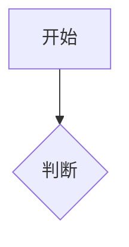

# 文档写作规范

> 移植自 ProjFlow documentation skill，适配 InternWiki 约定。配合 internwiki-reports SKILL.md 使用：SKILL.md 负责 CLI 与 frontmatter 规范，本文件负责**内容怎么写**。

## 1. 文件与 frontmatter

- 位置：`content/interns/{slug}/docs/`，支持子目录（如 `docs/基础/xxx.md`，slug 为 `基础/xxx`）
- 正文内不写 `# h1`（页面页头已渲染标题，系统会自动剥离首行 h1，但规范上从 `##` 开始）
- frontmatter 可选 `id`（数字）：控制文档列表排序——有 id 升序在前（教程/系列按阅读序），无 id 按日期降序在后
- 面向面试的文档：每篇末尾加"面试追问预案"（Q&A，模拟面试官深挖点，参照 junjiawang VoiceAgent 系列格式）

```yaml
---
title: JWT 认证指南
date: 2026-07-10
tags: [auth, jwt, 安全]
summary: 一句话概括（列表页与搜索展示）
id: 1
---
```

## 2. 标准结构

```markdown
## 概述

1-2 段：解决什么问题、面向谁、核心结论（summary 的扩展版）。

## 背景 / 动机

为什么需要这个方案？当前痛点是什么？

## 正文

按主题分节。每节先给结论，再给细节。指标用表格。

## 流程（可选）



## 相关文档

- [[project:xxx]] 或 [文字](other-doc.md)
```

## 3. 内部链接（InternWiki 语法）

| 语法 | 效果 |
|------|------|
| `[[project:slug]]` | 跳转到项目 |
| `[[project:slug\|文字]]` | 自定义文字跳转项目 |
| `[[task:slug/id]]` | 跳转到任务详情 |
| `[文字](docs/xxx.md)` | 引用其他文档（相对路径） |

## 4. Mermaid 图表

表达流程、时序、架构的首选方式，站点已支持渲染（暗色主题自适应、语法错误降级显示源码）。完整语法见 [mermaid-cheatsheet.md](mermaid-cheatsheet.md)。

使用原则：
1. 节点用名词或动宾短语（"校验 token"），避免长句
2. 同图风格统一：矩形 `[]` 步骤、菱形 `{}` 判断、圆角 `()` 起止
3. 复杂图拆成多个小图；主路径放左侧/上方
4. 图表上下必须有文字说明，不要只贴图

## 5. 写作风格

- 每段一个意思；能用表格就不用长列表；删"众所周知""不难发现"
- 中英混排：英文/数字与中文之间留一个半角空格（专有名词除外：Vue3、PyTorch）
- 日期 `YYYY-MM-DD`；术语首字母大写：REST API、SyncNet、3DGS
- 代码块标语言；命令行不带 `$ ` 前缀；配置优先 JSON/YAML 块
- 量化优先：数字必须有出处（实验记录/论文原文），不现编
