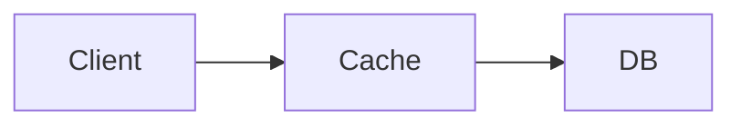

# InternWiki 实现计划

## Context

团队需要一个多人实习文档平台，每个实习生拥有独立空间，可保存**日报 / 周报 / 月报 / 文档**（Markdown 书写）和**个人任务管理体系**（JSON 存放数据）。

参考 `~/lifeOS`：它是一个基于 **Vite 6 + React 19 + TypeScript + Tailwind v4 + Velite** 的个人生活操作系统，把日/周/月/季/年报与项目任务树整合成一个公开站点。InternWiki 复用 lifeOS 的技术栈与数据流模式，但把单人结构扩展为**多实习生命名空间**，并按实习场景裁剪（去掉愿景/季报/年报，聚焦日报/周报/月报/文档/任务）。

**核心原则**：Markdown 内容源 + Velite 编译为类型化 JSON + React 客户端渲染，静态部署到 GitHub Pages。

---

## 第一阶段：项目骨架 + 技术栈

### 1.1 技术选型（对齐 lifeOS）

| 层 | 选型 | 说明 |
|----|------|------|
| 构建 | **Vite 6** | 开发服务器 + 静态打包 |
| UI 框架 | **React 19** + **TypeScript 5** | 客户端渲染 |
| 样式 | **Tailwind CSS v4** + shadcn/ui | `class-variance-authority` + `clsx` + `tailwind-merge` + `lucide-react` 图标 |
| 内容层 | **Velite** | Markdown → Zod 类型化 JSON（`.velite/`） |
| 路由 | **React Router v7** | 实习生维度路由 |
| 状态 | **Zustand** | 轻量全局状态（视图偏好、任务展开态） |
| 图表 | **recharts** | 习惯趋势、任务统计 |
| 日历 | **FullCalendar 6** | 日/周/月/列表视图，实习生日程展示 |
| Markdown 渲染 | **react-markdown** + `remark-gfm` + `rehype-raw` + `react-syntax-highlighter` | GFM 表格、代码高亮 |
| 部署 | **GitHub Actions** → **GitHub Pages** | `main` 推送自动构建发布 |

**与 lifeOS 的差异**：InternWiki 引入 FullCalendar 但增加**实习生选择器**——日历页顶部可切换实习生，查看其任务日程与日报关联；lifeOS 的日历是单人的，InternWiki 是多人按实习生过滤的。

### 1.2 目录结构

```
InternWiki/
├── apps/
│   └── web/                       # 主站（Vite + React）
│       ├── content/               # 内容源（Markdown + JSON）
│       │   ├── _shared/           # 团队共享
│       │   │   ├── onboarding/    # 入职指南 (*.md)
│       │   │   └── standards/     # 编码/写作规范 (*.md)
│       │   ├── interns/           # 实习生空间（每人生成目录）
│       │   │   └── {name}/
│       │   │       ├── profile.md        # 个人档案（frontmatter 元数据）
│       │   │       ├── daily/           # 日报 YYYY-MM-DD.md
│       │   │       ├── weekly/          # 周报 YYYY-Www.md
│       │   │       ├── monthly/         # 月报 YYYY-MM.md
│       │   │       ├── docs/            # 知识库文档 *.md
│       │   │       └── projects/        # 项目（每个含 README.md + tasks.json + notes/）
│       │   │           └── {slug}/
│       │   │               ├── README.md
│       │   │               ├── tasks.json
│       │   │               └── notes/      # 任务笔记（Markdown，notePath 引用）
│       │   └── site.yml           # 站点配置（标题、导航、实习生列表）
│       ├── src/
│       │   ├── main.tsx           # 入口
│       │   ├── App.tsx           # 路由 + 布局
│       │   ├── index.css         # Tailwind 入口（@import styles/*）
│       │   ├── styles/            # 模块化 CSS（对齐 lifeOS）
│       │   │   ├── variables.css   # 设计令牌（颜色/圆角，亮/暗双主题）
│       │   │   ├── base.css        # 重置 + 基础排版
│       │   │   ├── components.css   # .lo-card / .lo-nav / .lo-footer 等
│       │   │   ├── markdown.css     # .md-body 排版（标题/列表/代码块）
│       │   │   ├── calendar.css     # FullCalendar 主题覆写
│       │   │   └── utilities.css    # 工具类
│       │   ├── content/
│       │   │   ├── schema.ts     # Zod 运行时 schema（与 Velite 同步）
│       │   │   ├── loader.ts     # 数据加载器（getAll/getBySlug + async task fetch）
│       │   │   └── .velite/      # Velite 生成（gitignore）
│       │   ├── pages/
│       │   │   ├── Home.tsx              # 首页：实习生目录 + 全站概览
│       │   │   ├── InternHome.tsx       # 实习生仪表盘
│       │   │   ├── ReportPages.tsx      # 报告列表/详情（日/周/月/文档 通用）
│       │   │   ├── Projects.tsx         # 项目页（Tabs + 左右布局：Git 树 + README/笔记）
│       │   │   ├── Calendar.tsx        # 日历页（实习生选择 + 日程视图）
│       │   │   └── Habits.tsx           # 习惯追踪页
│       │   ├── components/
│       │   │   ├── MarkdownView.tsx     # Markdown 渲染（react-markdown + remark-gfm + rehype-raw）
│       │   │   ├── ReportList.tsx       # 报告列表
│       │   │   ├── ReportDetail.tsx     # 报告详情
│       │   │   ├── RelatedReports.tsx   # 上下层/相邻报告链接
│       │   │   ├── TaskTreeNode.tsx    # Git 风格任务树节点（分支线 + hover tooltip）
│       │   │   ├── ProjectTabs.tsx      # 项目切换 Tabs（pill 样式 + 状态图标）
│       │   │   ├── Heatmap.tsx          # 贡献热力图
│       │   │   ├── InternSelect.tsx     # 实习生选择器（日历等页面共用）
│       │   │   ├── SearchModal.tsx      # 搜索弹窗
│       │   │   └── ThemeToggle.tsx      # 暗/亮模式
│       │   ├── lib/
│       │   │   ├── utils.ts            # cn() 等工具
│       │   │   └── markdown.ts         # internalLinkHref() + stripMarkdown()
│       │   └── hooks/
│       │       ├── useTheme.ts         # 主题 hook（localStorage + 系统偏好）
│       │       └── useHabits.ts        # 习惯数据提取
│       ├── public/               # 静态资源（favicon 等）
│       ├── velite.config.ts      # Velite 内容 schema + collections
│       ├── vite.config.ts        # Vite 配置（base 路径、React 插件、projectTasksPlugin）
│       ├── tsconfig.json
│       └── eslint.config.js
├── scripts/
│   └── cli.mjs                  # CLI（new-intern / new-report / task）
├── .github/workflows/deploy.yml # CI/CD
├── pnpm-workspace.yaml
├── package.json
├── PLAN.md
└── README.md
```

### 1.3 数据流（参考 lifeOS）

```
┌───────────────────────────────┐
│ Markdown / JSON (content/)    │  ← 人工编辑，git 友好
└──────────────┬────────────────┘
               │ Velite 构建时解析（Zod schema 校验）
               ▼
┌───────────────────────────────┐
│ 类型化 JSON (.velite/)        │
└──────────────┬────────────────┘
               │ Vite 静态打包
               ▼
┌───────────────────────────────┐
│ React 组件 + Tailwind UI      │  ← 客户端渲染
└──────────────┬────────────────┘
               │ GitHub Pages 部署
               ▼
┌───────────────────────────────┐
│ InternWiki 站点               │
└───────────────────────────────┘
```

### 1.4 Velite 内容 Schema (`apps/web/velite.config.ts`)

参考 lifeOS 的 `velite.config.ts`，按实习生命名空间定义 collections：

```ts
import { defineConfig, defineCollection, s } from 'velite'

// 报告（日报/周报/月报/文档 共用）
const reportSchema = s
  .object({
    title: s.string().optional(),
    slug: s.string().optional(),
    date: s.isodate().optional(),
    summary: s.string().optional(),
    metadata: s.record(s.string(), s.unknown()).default({}),
    body: s.raw(),
  })
  .transform((data, { meta }) => {
    const parts = ((meta.path ?? '').replace(/\.md$/, '')).split('/')
    const filename = parts.pop() ?? ''
    const intern = parts[parts.indexOf('interns') + 1] ?? ''
    return {
      ...data,
      title: data.title ?? filename,
      slug: data.slug ?? filename,
      intern,
    }
  })

// 项目
const projectSchema = s.object({
  title: s.string().optional(),
  slug: s.string().optional(),
  status: s.enum(['active', 'completed', 'paused', 'planned']).default('active'),
  startDate: s.isodate().optional(),
  endDate: s.isodate().nullish(),
  tags: s.array(s.string()).default([]),
  summary: s.string().optional(),
  metadata: s.record(s.string(), s.unknown()).default({}),
  body: s.raw(),
})

// 实习生档案
const internSchema = s.object({
  name: s.string(),
  team: s.string().optional(),
  role: s.string().optional(),
  startDate: s.isodate().optional(),
  body: s.raw(),
})

export default defineConfig({
  root: 'content',
  output: {
    data: 'src/content/.velite',
    assets: 'src/content/.velite/assets',
    base: '/InternWiki/assets/',
    name: '[name]-[hash:6].[ext]',
    clean: true,
  },
  collections: {
    interns: defineCollection({ name: 'interns', pattern: 'interns/*/profile.md', schema: internSchema }),
    daily:    defineCollection({ name: 'daily',    pattern: 'interns/*/daily/**/*.md',    schema: reportSchema }),
    weekly:   defineCollection({ name: 'weekly',   pattern: 'interns/*/weekly/**/*.md',   schema: reportSchema }),
    monthly:  defineCollection({ name: 'monthly',  pattern: 'interns/*/monthly/**/*.md',  schema: reportSchema }),
    docs:     defineCollection({ name: 'docs',     pattern: 'interns/*/docs/**/*.md',     schema: reportSchema }),
    shared:   defineCollection({ name: 'shared',   pattern: '_shared/**/*.md',            schema: reportSchema }),
    projects: defineCollection({ name: 'projects', pattern: 'interns/*/projects/*/README.md', schema: projectSchema }),
  },
  markdown: { gfm: true, removeComments: true },
})
```

> 任务树 `tasks.json` 不走 Velite（Velite 主要处理 Markdown），改为 **Vite 插件** `projectTasksPlugin` 在 dev 中间件中按 `{base}/{intern}/{slug}.tasks.json` 路径 serve，生产构建时复制到 `dist/`。客户端通过 `fetch` 异步加载。详见 3.1。

### 1.5 关键依赖

| 包 | 用途 |
|----|------|
| `react` / `react-dom` 19 | UI |
| `react-router-dom` 7 | 路由 |
| `velite` | Markdown → JSON |
| `tailwindcss` v4 + `@tailwindcss/vite` | 样式 |
| `class-variance-authority` / `clsx` / `tailwind-merge` | 样式工具 |
| `lucide-react` | 图标 |
| `react-markdown` / `remark-gfm` / `rehype-raw` / `react-syntax-highlighter` | Markdown 渲染 |
| `zustand` | 状态 |
| `recharts` | 图表 |
| `@fullcalendar/react` + `daygrid` + `timegrid` + `interaction` + `list` | 日历 |
| `zod` | 运行时校验 |
| `gray-matter` | CLI 解析 frontmatter |

---

## 第二阶段：内容模型

所有内容均为 Markdown（frontmatter + 正文）。实习生通过文件名/目录归属到 `{name}` 命名空间。

### 2.1 日报 `content/interns/{name}/daily/YYYY-MM-DD.md`

```yaml
---
title: 日报 - 2026-07-07 周二
slug: 2026-07-07
date: 2026-07-07
summary: 完成用户认证接口，推进限流中间件
tags: [后端, API]
---

## ✅ 今日完成
- 完成用户认证接口 PR #42
- Review 了 Bob 的数据库迁移

## 🚧 进行中
- API 限流中间件 (60%)

## 🚫 阻塞项
- 等待 DevOps 配置 staging Redis

## 📝 笔记
发现令牌桶算法的有用模式

## 🔄 习惯打卡
- [x] 晨会 #routine
- [x] 代码审查 #growth
- [ ] 文档更新 #writing
```

构建时从 `- [x] desc #tag` 提取习惯数据。

### 2.2 周报 `content/interns/{name}/weekly/YYYY-Www.md`

```yaml
---
slug: 2026-W28
date: 2026-07-07
summary: 交付认证接口，解决 3 个支付 Bug
tags: [周报]
---

## 📊 本周总结
## 🎯 关键成果
- 交付用户认证接口
- 解决支付流程 3 个关键 Bug
## 📈 数据
- PR 合并: 4
## 🔮 下周计划
## 💭 反思
```

### 2.3 月报 `content/interns/{name}/monthly/YYYY-MM.md`

```yaml
---
slug: 2026-07
date: 2026-07-31
summary: 7 月实习总结：认证系统上线，启动搜索项目
tags: [月报]
---

## 📅 月度概览
<!-- 自动聚合本月周报关键成果与日报统计 -->

## 🏆 重要成果
- 用户认证系统全量上线
- 搜索引擎项目立项并完成 schema 设计

## 📊 月度数据
- 工作日: 22
- PR 合并: 18
- 文档产出: 6 篇

## 📈 成长复盘
- 技术成长：
- 协作成长：

## 🔮 下月计划
- 完成搜索引擎 MVP
- 推进集成测试框架
```

月报详情页自动聚合本月周报摘要与日报统计（PR 数、习惯打卡率等）。

### 2.4 文档 `content/interns/{name}/docs/*.md`

```yaml
---
title: Redis 缓存指南
slug: redis-cache-guide
date: 2026-07-05
updated: 2026-07-07
tags: [redis, 缓存, 后端]
---

## 概述
...

## 架构图


## 配置参考
...
```

### 2.5 实习生档案 `content/interns/{name}/profile.md`

```yaml
---
name: 张三
slug: alice
team: 后端组
role: 后端开发实习生
startDate: 2026-06-01
---

## 自我介绍
后端组实习生，主要参与搜索引擎和数据管道相关工作...
```

### 2.6 报告层级导航

参考 lifeOS 日报中的上下层链接，每篇报告 frontmatter 或正文带导航：
- 日报 → 所属周报 / 月报
- 周报 → 所属月报 + 本周日报
- 月报 → 本月周报 + 所属年报（可选）

由 `RelatedReports` 组件按 slug/date 自动计算，无需手写。

---

## 第三阶段：任务管理体系（JSON）

每个实习生拥有自己的任务体系，以 JSON 文件存放数据。参考 lifeOS 的 `tasks.json` 结构：项目为粒度，每项目一个 `tasks.json`，支持递归子任务、状态、周期任务。

### 3.1 数据存放与加载

```
content/interns/{name}/projects/{slug}/
├── README.md     # 项目说明（frontmatter: title/status/startDate/tags/timeline）
├── tasks.json    # 任务树数据
└── notes/        # 任务笔记（Markdown，notePath 引用，如 notes/task-detail.md）
```

**加载方式：Vite 插件 `projectTasksPlugin`**（对齐 lifeOS）

参考 lifeOS 的 `vite.config.ts` 中的 `projectTasksPlugin()`：

- **Dev**：Vite 中间件拦截 `/{base}/interns/{name}/{slug}.tasks.json` 请求，从 `content/interns/{name}/projects/{slug}/tasks.json` 读取并返回
- **Dev**：同时拦截 `/{base}/interns/{name}/{slug}/{notePath}` 请求，serve 任务笔记 Markdown
- **Build**：`closeBundle` 钩子将所有 `tasks.json` 复制到 `dist/` 下对应路径
- **客户端**：`getProjectTasks(intern, slug)` 返回 `Promise<TaskTree | null>`，通过 `fetch` 异步加载

```ts
// loader.ts
export async function getProjectTasks(internSlug: string, projectSlug: string): Promise<TaskTree | null> {
  const res = await fetch(`/InternWiki/interns/${internSlug}/${projectSlug}.tasks.json`)
  if (!res.ok) return null
  const tree: TaskTree = await res.json()
  return { ...tree, tasks: cascadeStatus(tree.tasks) }
}
```

### 3.2 tasks.json 结构

```json
{
  "project": "search-engine",
  "intern": "alice",
  "tasks": [
    { "id": "t1", "title": "设计索引 Schema", "status": "completed", "assignee": "alice", "startDate": "2026-06-01", "endDate": "2026-06-05", "description": "", "notePath": "notes/schema-design.md", "tags": ["后端"], "children": [] },
    {
      "id": "t2",
      "title": "实现爬虫",
      "status": "active",
      "assignee": "alice",
      "startDate": "2026-06-06",
      "endDate": null,
      "description": "URL 队列 + HTML 解析",
      "children": [
        { "id": "t2-1", "title": "URL 队列", "status": "completed", "startDate": null, "endDate": null, "description": "", "children": [] },
        { "id": "t2-2", "title": "HTML 解析器", "status": "active", "startDate": null, "endDate": null, "description": "", "notePath": "notes/html-parser.md", "children": [] },
        { "id": "t2-3", "title": "Robots.txt 遵守", "status": "blocked", "startDate": null, "endDate": null, "description": "", "children": [] }
      ]
    },
    { "id": "r-1", "title": "每日代码提交", "status": "active", "description": "", "recurring": { "pattern": "daily", "startTime": "21:00", "endTime": "21:30", "activeFrom": "2026-07-07", "excludeDates": [], "reportLevels": ["daily"] }, "tags": ["routine"], "children": [] }
  ]
}
```

**任务状态**：`planned` / `active` / `completed` / `paused` / `blocked`
**递归层级**：`children[]` 任意深度
**周期任务**：`recurring` 字段（daily/weekly/every-N-days），`reportLevels` 指定出现在哪些报告中，可展开为日历事件
**任务字段**（对齐 lifeOS 最新 TaskNode）：

| 字段 | 类型 | 说明 |
|------|------|------|
| `assignee` | string? | 执行人（显示在任务行和 tooltip 中） |
| `notePath` | string? | 任务笔记路径（相对项目目录，如 `notes/detail.md`），点击任务在右侧面板渲染笔记 |
| `tags` | string[]? | 习惯标签（如 `["routine", "growth"]`），用于习惯追踪 |
| `startTime` / `endTime` | string? | 一次性定时任务的时间（HH:MM），用于日历时间轴视图 |
| `location` | string? | 地点，日历事件显示 |
| `category` | string? | 日历着色分类（study/health/work/social/life/other） |
| `blockedBy` | string[]? | 阻塞关系（可选） |

### 3.3 任务树引擎 (`components/TaskTreeNode.tsx` + `pages/Projects.tsx`)

参考 lifeOS 最新 `Projects.tsx`（633 行）的 Git 风格任务树实现：

**页面架构**（单页 + URL hash，非路由式）：
```
┌─────────────────────────────────────────────┐
│ [ProjectA] [ProjectB] [ProjectC]  ← Tabs   │
├──────────────┬──────────────────────────────┤
│ 左侧 280px    │ 右侧 1fr                     │
│              │                              │
│ Git 风格      │ 点击任务前: ProjectREADME     │
│ 任务树        │ 点击任务后: TaskNoteView     │
│ (递归分支线)  │ (fetch notePath 渲染 Markdown)│
│              │                              │
│ ● t1 完成     │ ## 项目说明                  │
│ ├─ t1-1      │ ...                          │
│ ├─ t1-2      │                              │
│ ◉ t2 进行中   │ ---                          │
│ │  ├─ t2-1   │ ## 任务笔记                  │
│ │  ├─ t2-2 ← │ (点击的任务笔记)              │
│ │  └─ t2-3   │                              │
│ ⏸ t3 暂停     │                              │
└──────────────┴──────────────────────────────┘
```

**TaskTreeNode 组件**：
- **Git 分支线**：`parentLines: boolean[]` 数组控制每一层是否画竖线，`isLast` 控制最后一个子任务的拐角
- **状态圆点**：`planned`(灰) / `active`(绿) / `completed`(蓝+透明) / `paused`(琥珀) / `blocked`(红)，带 `ring-2` 外圈
- **展开/折叠**：`useState(depth < 1)` 默认展开第一层，ChevronRight/Down 图标
- **子任务计数**：有子任务时显示 `completed/total`
- **Hover tooltip**（400ms 延迟）：显示状态、执行人、时间、地点、描述、子任务进度条
- **选中态**：点击任务 → 右侧面板切换为 `TaskNoteView`，`selectedId` 高亮当前行
- **assignee**：右侧显示头像+名字 pill
- **startTime**：显示时钟图标+时间
- **notePath**：显示文件图标，提示可点击查看笔记

**TaskNoteView 组件**：
- 点击有 `notePath` 的任务时，`fetch` 加载 Markdown 笔记并用 `react-markdown` 渲染
- 无 `notePath` 时显示 `description` 纯文本
- 无两者时显示"该任务暂无描述或笔记"

**ProjectTabs 组件**：
- pill 样式标签页，按项目颜色着色（emerald/blue/amber/violet/pink/cyan 循环）
- 切换时更新 URL hash（`#search-engine`）并加载对应 tasks.json
- 状态图标：GitBranch(active) / CheckCircle2(completed) / Pause(paused) / Circle(planned)

**级联完成**：`cascadeStatus()` 递归处理，子任务全部 completed → 父任务自动标记 completed

**多项目聚合**：实习生仪表盘聚合该实习生所有项目的任务树统计

### 3.4 任务管理 CLI (`scripts/task.mjs`)

```bash
# 任务增删改查（直接读写 tasks.json）
pnpm task add    --intern alice --project search-engine --title "添加测试" --parent t2
pnpm task done   --intern alice --project search-engine --id t2-2
pnpm task list   --intern alice --project search-engine
pnpm task stats  --intern alice          # 聚合所有项目统计
```

---

## 第四阶段：页面、路由与仪表盘

### 4.1 路由设计 (`src/App.tsx`)

参考 lifeOS 的路由结构，加入实习生维度：

```
/                                  首页（实习生目录 + 全站概览）
/calendar                          日历页（含实习生选择器）
/calendar?intern=alice             指定实习生日程
/interns/:name                     实习生仪表盘
/interns/:name/daily               日报列表
/interns/:name/daily/:slug         日报详情
/interns/:name/weekly              周报列表
/interns/:name/weekly/:slug        周报详情
/interns/:name/monthly             月报列表
/interns/:name/monthly/:slug       月报详情
/interns/:name/docs                文档列表
/interns/:name/docs/:slug          文档详情
/interns/:name/projects            项目页（Tabs + 左右布局，URL hash 切换项目）
/shared                            团队共享文档
```

导航栏：首页 / 日历 / 实习生切换器（下拉）/ 搜索 / 暗亮模式。

### 4.2 实习生仪表盘 (`pages/InternHome.tsx`)

每个实习生主页自动生成：

| 组件 | 数据来源 | 展示 |
|------|----------|------|
| 活动热力图 | 日报日期 | GitHub 风格贡献网格（`Heatmap`） |
| 任务进度 | 所有 tasks.json | 进度条 + 当前 active 任务 |
| 习惯打卡 | 日报 `- [x] #tag` | 连续天数 + 30 天趋势线（recharts） |
| 最近报告 | 最新 5 篇日/周/月报 | 卡片列表带摘要 |
| 任务统计 | 所有任务树 | completed/active/planned 饼图 |
| 文档列表 | docs/ | 按更新时间排序 |

### 4.3 报告页（`pages/ReportPages.tsx`）

复用 lifeOS 的 `makeListPage` / `makeDetailPage` 工厂模式，按 collection 配置（daily/weekly/monthly/docs）生成列表与详情，详情页带 `RelatedReports` 上下层导航。

### 4.4 习惯追踪 (`pages/Habits.tsx` + `hooks/useHabits.ts`)

- 扫描实习生所有日报的 `- [x] desc #tag` 模式
- 生成 `tag × date` 热力图数据
- 计算连续打卡天数、完成率、周/月趋势

### 4.5 日历页 (`pages/Calendar.tsx`)

参考 lifeOS 的 `Calendar.tsx`（基于 FullCalendar 6），核心改动是增加**实习生选择器**：

**页面结构**：

```
┌──────────────────────────────────────────────────────┐
│ [实习生选择器 ▼]                          [下载 ICS] │
├────────────────────────────┬─────────────────────────┤
│                            │  侧边栏                  │
│   FullCalendar             │  ┌─────┬──────┐         │
│   ┌──────────────────┐     │  │待办 │已完成│         │
│   │  月  周  3日  日  │     │  ├─────┴──────┤         │
│   │                  │     │  │ 今日事项列表  │         │
│   │   日历网格       │     │  │ 无日期任务    │         │
│   │   (任务事件着色)  │     │  │ 近期完成      │         │
│   └──────────────────┘     │  └──────────────┘         │
└────────────────────────────┴─────────────────────────┘
```

**实习生选择器** (`components/InternSelect.tsx`)：
- 顶部下拉框，列出所有实习生
- 默认选中第一个实习生（或 URL `?intern=` 参数指定的）
- 切换实习生时，重新加载该实习生的所有任务事件
- 选择器状态同步到 URL query param，可分享链接

**数据来源**（按选中实习生过滤）：

| 事件类型 | 来源 | 说明 |
|----------|------|------|
| 有日期任务 | `tasks.json` 中 `startDate` 非空的任务 | 全天或多日事件 |
| 定时任务 | `tasks.json` 中带 `startTime`/`endTime` 的任务 | 时间轴视图显示 |
| 周期任务 | `tasks.json` 中 `recurring` 字段 | 展开为日期区间内每日/每周实例 |
| 日报标记 | 日报 `daily/*.md` 的 `date` | 日历上的小圆点标记，点击跳转日报详情 |

**事件着色**：
- 按项目 slug 分配颜色（每个项目一种主题色）
- completed 任务显示删除线 + 透明度降低
- 参考 lifeOS 的 `PROJECT_TASK_COLORS` 映射

**日历视图**：
- 月视图 / 周视图 / 3 日视图 / 日视图 / 列表视图
- 中文本地化（`locale="zh-cn"`，周一为首日）
- 当前时间指示线（`nowIndicator`）

**侧边栏**（参考 lifeOS）：
- 待办 / 已完成 两个 Tab
- 今日事项列表（点击跳详情弹窗）
- 无日期任务列表
- 近期完成任务列表（30 天内）

**详情弹窗**：
- 点击事件弹出详情：标题、项目、状态、日期/时间、描述、子任务进度
- 如果当天有日报，显示「查看当日日报」链接

---

## 第五阶段：高级功能

### 5.1 搜索 (`components/SearchModal.tsx`)

- Velite 构建后生成 `public/search-index.json`（标题/摘要/正文/slug/intern/type）
- 客户端轻量模糊匹配（可选 Fuse.js 或自实现）
- 过滤器：按实习生、类型（日报/周报/月报/文档）、标签
- 中文搜索：可选接入 `pinyin-pro` 生成拼音索引

### 5.2 暗/亮模式 (`components/ThemeToggle.tsx`)

- Tailwind v4 CSS 变量主题
- 本地存储偏好 + 系统偏好检测
- 导航栏切换按钮

### 5.3 部署 (`.github/workflows/deploy.yml`)

```yaml
# main 推送 → pnpm install → velite build → vite build → 发布 gh-pages
# base 路径: /InternWiki/
```

构建命令（对齐 lifeOS）：
```bash
velite build && tsc -b && vite build
```

---

## 第六阶段：CLI 工具 (按领域拆分)

```bash
# 构建/开发
pnpm dev                          # Vite 开发服务器（默认 :5180，HMR）
pnpm build                        # velite build + vite build

# 实习生与报告管理 (scripts/report.mjs)
pnpm report new-intern   --name 张三 --slug alice --team 后端组 --start-date 2026-06-01
pnpm report new-daily    --intern alice [--date 2026-07-07]
pnpm report new-weekly   --intern alice [--week 2026-W28]
pnpm report new-monthly  --intern alice [--month 2026-07]
pnpm report new-doc      --intern alice --title "Redis 缓存指南"

# 项目创建 (scripts/project.mjs)
pnpm project new --intern alice --slug search-engine --title "搜索引擎"

# 任务管理 (scripts/task.mjs，见 3.4)
```

CLI 生成带 frontmatter 的 Markdown 模板与目录结构。

---

## 实施路线图

| 阶段 | 内容 | 产出 |
|------|------|------|
| **Phase 1** | 骨架 + Velite + 路由 | Markdown 经 Velite 编译，React 页面可渲染 |
| **Phase 2** | 内容模型 | 日报/周报/月报/文档/档案完整渲染 |
| **Phase 3** | 任务体系 | tasks.json 任务树、级联完成、CLI 管理 |
| **Phase 4** | 仪表盘 + 习惯 + 日历 | 实习生主页、热力图、习惯趋势、日历日程 |
| **Phase 5** | 高级功能 | 搜索、暗亮模式、部署 |
| **Phase 6** | CLI | 内容创建与管理命令 |

---

## 验证计划

1. **Velite 构建** — 创建示例实习生（含几篇日/周/月报与文档），`pnpm content:build` 确认 `.velite/` 生成类型化 JSON
2. **路由渲染** — `pnpm dev` 确认列表/详情页正确渲染 Markdown（GFM 表格、代码高亮）
3. **任务树** — 创建 tasks.json，验证递归渲染、级联完成、状态统计
4. **仪表盘** — 确认热力图、习惯趋势、任务统计正确聚合
5. **日历** — 确认实习生选择器切换、任务事件渲染、周期任务展开、日报跳转
6. **搜索** — 确认搜索索引生成、过滤与模糊匹配可用
7. **部署** — 推送 main，确认 GitHub Actions 构建发布到 gh-pages
8. **CLI** — 测试 new-intern / new-report / task 命令生成正确文件
