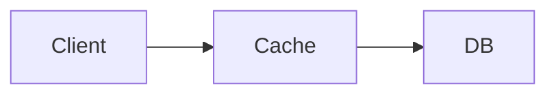

# InternWiki

实习生之间相互分享工作成果——一个人的项目，会变成很多个人的项目。

## 这是什么

InternWiki 是一个多人实习文档平台。每个实习生拥有独立空间，把自己的实习工作沉淀为日报、周报、月报和知识库文档。大家互相阅读、互相学习，让一个人的经验扩散成团队的财富。

- **多人空间** — 每个实习生拥有独立的 `daily/`、`weekly/`、`monthly/`、`docs/`、`projects/` 目录
- **日报 / 周报 / 月报** — 结构化模板，自动生成摘要和统计
- **知识库文档** — 最核心的内容，面向小白读者，面试导向（详见写作规范）
- **项目任务树** — JSON 定义的任务层级，支持递归子任务和状态追踪
- **习惯追踪** — 从日报中自动提取打卡记录，生成热力图和趋势线
- **全文搜索** — 按实习生 / 类型 / 标签过滤
- **暗 / 亮模式** — 本地存储偏好

## 技术栈

| 层 | 选型 |
|----|------|
| 构建 | Vite 6 |
| UI 框架 | React 19 + TypeScript 5 |
| 样式 | Tailwind CSS v4 + shadcn/ui |
| 内容层 | Velite（Markdown → Zod 类型化 JSON） |
| 路由 | React Router v7 |
| 状态 | Zustand |
| 图表 | recharts |
| 部署 | GitHub Actions → GitHub Pages |

## 快速开始

```bash
# 启用 corepack
corepack enable

# 安装依赖
pnpm install

# 启动开发服务器（默认 :5173，HMR 热更新）
pnpm dev

# 构建静态站点
pnpm build

# 新增实习生
pnpm cli new-intern --name 张三 --slug alice --team 后端组 --start-date 2026-06-01

# 新增日报
pnpm cli new-report --intern alice --type daily

# 新增月报
pnpm cli new-report --intern alice --type monthly --month 2026-07
```

打开 http://localhost:5173/InternWiki/ 查看站点。

## 项目结构

```
InternWiki/
├── apps/
│   └── web/                       # 主站（Vite + React）
│       ├── content/               # 内容源（Markdown + JSON）
│       │   ├── _shared/           # 团队共享（入职指南、规范）
│       │   ├── interns/           # 实习生空间
│       │   │   └── {name}/
│       │   │       ├── profile.md        # 个人档案
│       │   │       ├── daily/           # 日报 YYYY-MM-DD.md
│       │   │       ├── weekly/          # 周报 YYYY-Www.md
│       │   │       ├── monthly/         # 月报 YYYY-MM.md
│       │   │       ├── docs/            # 知识库文档 *.md
│       │   │       ├── assets/          # 该实习生的所有图片
│       │   │       └── projects/        # 项目（README.md + tasks.json）
│       │   │           └── {slug}/
│       │   │               ├── README.md
│       │   │               └── tasks.json
│       │   └── site.yml           # 站点配置
│       ├── src/                   # React 源码
│       │   ├── App.tsx           # 路由 + 布局
│       │   ├── pages/            # 页面组件
│       │   ├── components/       # 通用组件
│       │   └── content/          # Velite 生成 + loader
│       ├── velite.config.ts      # Velite 内容 schema
│       └── vite.config.ts        # Vite 配置
├── scripts/
│   └── cli.mjs                  # CLI 工具
├── .github/workflows/deploy.yml # CI/CD
├── pnpm-workspace.yaml
├── PLAN.md                       # 详细实现计划
└── README.md
```

---

## 写作规范与约定

### 报告形式

所有报告均为 Markdown 文件，放在实习生各自目录下。

| 类型 | 路径 | 命名规则 | 必填 frontmatter |
|------|------|----------|-------------------|
| 日报 | `daily/` | `YYYY-MM-DD.md` | `slug`, `date`, `tags` |
| 周报 | `weekly/` | `YYYY-Www.md` | `slug`, `date`, `tags` |
| 月报 | `monthly/` | `YYYY-MM.md` | `slug`, `date`, `tags` |
| 文档 | `docs/` | 自定义英文名.md | `title`, `slug`, `date`, `tags` |

`summary` 字段可选，会显示在列表页卡片上。

#### 日报结构

```markdown
## 今日完成
## 进行中
## 阻塞项
## 笔记
## 习惯打卡
- [x] 晨会 #routine
- [x] 代码审查 #growth
- [ ] 文档更新 #writing
```

#### 周报结构

```markdown
## 本周总结
## 关键成果
## 数据
## 下周计划
## 反思
```

#### 月报结构

```markdown
## 月度概览
## 重要成果
## 月度数据
## 成长复盘
## 下月计划
```

### 文档写作要求

> 文档是 InternWiki 最核心的内容。

**1. 面向小白读者**

把读者当作什么都不懂的人，一步步说明你到底做了什么工作。不要假设读者了解你的项目背景、技术栈或业务上下文。从"为什么做这件事"开始，到"怎么做的"、"遇到了什么问题"、"怎么解决的"，完整讲清楚。

**2. 面试导向**

写文档的最终目标：让读者（包括面试官）读完之后，觉得你真的做了这份工作，而且经得起追问。一篇好的文档应该能让你在面试时对着它讲半小时都不虚。

**3. 不要完全使用 AI 写文档**

AI 可以辅助润色措辞、整理排版、检查错别字，但文档的内容必须是你自己真实做过、真正理解透的。照搬 AI 生成的空泛内容，面试官一追问就露馅。你的文档应该体现你自己的思考过程和踩坑经历，这些是 AI 编不出来的。

**4. 多加图片**

截图、架构图、流程图、代码运行结果、终端输出……能放图就放图，图片比纯文字直观得多。一张架构图胜过三段文字描述。

### 图片约定

每个实习生的所有图片统一存放在 `content/interns/{name}/assets/` 目录下。

```
content/interns/alice/assets/
├── search-engine-architecture.png
├── redis-cache-flow.png
└── api-error-screenshot.png
```

在 Markdown 中用相对路径引用：

```markdown

```

图片命名建议：`项目名-描述.png`，用英文小写 + 连字符，避免中文和空格。

---

## 内容格式示例

### 日报

```markdown
---
slug: 2026-07-07
date: 2026-07-07
summary: 完成用户认证接口，推进限流中间件
tags: [后端, API]
---

## 今日完成
- 完成用户认证接口 PR #42
- Review 了 Bob 的数据库迁移

## 进行中
- API 限流中间件 (60%)

## 阻塞项
- 等待 DevOps 配置 staging Redis

## 笔记
发现令牌桶算法的有用模式

## 习惯打卡
- [x] 晨会 #routine
- [x] 代码审查 #growth
- [ ] 文档更新 #writing
```

### 周报

```markdown
---
slug: 2026-W28
date: 2026-07-07
summary: 交付认证接口，解决 3 个支付 Bug
tags: [周报]
---

## 本周总结
## 关键成果
- 交付用户认证接口
- 解决支付流程 3 个关键 Bug
## 数据
- PR 合并: 4
## 下周计划
## 反思
```

### 月报

```markdown
---
slug: 2026-07
date: 2026-07-31
summary: 7 月实习总结：认证系统上线，启动搜索项目
tags: [月报]
---

## 月度概览
## 重要成果
- 用户认证系统全量上线
- 搜索引擎项目立项并完成 schema 设计
## 月度数据
- 工作日: 22
- PR 合并: 18
## 成长复盘
## 下月计划
```

### 知识库文档

```markdown
---
title: Redis 缓存指南
slug: redis-cache-guide
date: 2026-07-05
tags: [redis, 缓存, 后端]
---

## 概述
为什么要用缓存，解决了什么问题……

## 架构图




## 配置参考
...
```

### 项目任务树

每个项目目录下有一个 `tasks.json`，用 JSON 存放任务数据：

```json
{
  "project": "search-engine",
  "intern": "alice",
  "tasks": [
    {
      "id": "t1",
      "title": "设计索引 Schema",
      "status": "completed",
      "startDate": "2026-06-01",
      "endDate": "2026-06-05",
      "description": "",
      "children": []
    },
    {
      "id": "t2",
      "title": "实现爬虫",
      "status": "active",
      "description": "URL 队列 + HTML 解析",
      "children": [
        { "id": "t2-1", "title": "URL 队列", "status": "completed", "children": [] },
        { "id": "t2-2", "title": "HTML 解析器", "status": "active", "children": [] },
        { "id": "t2-3", "title": "Robots.txt 遵守", "status": "planned", "children": [] }
      ]
    }
  ]
}
```

任务状态取值：`planned` / `active` / `completed` / `paused`。子任务全部 `completed` 时父任务自动标记完成。

---

## CLI 命令

| 命令 | 说明 |
|------|------|
| `pnpm dev` | 启动开发服务器（默认 :5173，HMR） |
| `pnpm build` | 构建静态站点（velite build + vite build） |
| `pnpm cli new-intern` | 创建新实习生空间 |
| `pnpm cli new-report --type daily` | 创建日报 |
| `pnpm cli new-report --type weekly` | 创建周报 |
| `pnpm cli new-report --type monthly` | 创建月报 |
| `pnpm cli new-doc` | 创建知识库文档 |
| `pnpm cli task add` | 添加项目任务 |
| `pnpm cli task done` | 标记任务完成 |
| `pnpm cli task list` | 列出项目任务树 |
| `pnpm cli task stats` | 聚合实习生任务统计 |

## 部署

`main` 分支推送后，GitHub Actions 自动执行 `velite build && tsc -b && vite build`，构建产物发布到 GitHub Pages。

站点地址：`https://{user}.github.io/InternWiki/`

## 许可证

MIT
# InternWiki

多人实习文档平台 — 每个实习生拥有独立项目空间，支持日报、周报、知识库文档和项目任务管理。

基于自定义 Node.js 静态站点生成器，将纯 Markdown 文件编译为 HTML 页面。

## 特性

- **多人空间** — 每个实习生拥有独立的 `daily/`、`weekly/`、`docs/`、`projects/` 目录
- **日报 & 周报** — 结构化模板，自动生成摘要和统计
- **项目任务树** — JSON 定义的任务层级，支持级联完成和状态追踪
- **习惯追踪** — 从日报中自动提取打卡记录，生成热力图
- **知识库文档** — 支持 PDF 展示、Mermaid 图表、数学公式
- **全文搜索** — 中文拼音搜索，按实习生/类型/标签过滤
- **增量构建** — SHA1 缓存，仅重建变更页面
- **开发服务器** — 文件监听 + WebSocket LiveReload

## 快速开始

```bash
# 安装依赖
npm install

# 启动开发服务器
npm run serve

# 构建静态站点
npm run build

# 新增实习生
node scripts/cli.js new-intern --name 张三 --team 后端组 --start-date 2026-06-01

# 新增日报
node scripts/cli.js new-report --intern 张三 --type daily

# 新增周报
node scripts/cli.js new-report --intern 张三 --type weekly
```

## 项目结构

```
InternWiki/
├── content/              # 内容源（Markdown + JSON）
│   ├── _shared/          # 团队共享内容（入职指南、规范）
│   ├── interns/          # 实习生空间
│   │   └── {name}/
│   │       ├── profile.md      # 个人信息
│   │       ├── daily/          # 日报 (YYYY-MM-DD.md)
│   │       ├── weekly/         # 周报 (YYYY-Www.md)
│   │       ├── projects/       # 项目（tasks.json + 文档）
│   │       └── docs/           # 知识库文档
│   └── config.yml        # 站点配置
├── src/templates/        # HTML 模板
├── lib/                  # 构建系统模块
├── assets/               # CSS、JS、静态资源
├── scripts/cli.js        # CLI 工具
├── dist/                 # 构建输出
├── PLAN.md               # 详细实现计划
└── README.md
```

## 内容格式

### 日报

```yaml
---
date: 2026-07-07
type: daily
intern: 张三
tags: [后端, API]
---

## ✅ 今日完成
- 完成了用户认证接口

## 🚧 进行中
- API 限流中间件 (60%)

## 🚫 阻塞项
- 等待 DevOps 配置 Redis 实例

## 🔄 习惯打卡
- [x] 晨会 #routine
- [x] 代码审查 #growth
- [ ] 文档更新 #writing
```

### 周报

```yaml
---
week: 2026-W28
type: weekly
intern: 张三
---

## 📊 本周总结
<!-- 构建时自动注入日报摘要 -->

## 🎯 关键成果
- 交付了用户认证接口

## 🔮 下周计划
- 完成限流中间件
```

### 项目任务树

```json
{
  "project": "搜索引擎",
  "intern": "张三",
  "status": "active",
  "tasks": [
    { "id": "t1", "title": "设计索引 Schema", "status": "done" },
    {
      "id": "t2",
      "title": "实现爬虫",
      "status": "in-progress",
      "children": [
        { "id": "t2a", "title": "URL 队列", "status": "done" },
        { "id": "t2b", "title": "HTML 解析器", "status": "in-progress" }
      ]
    }
  ]
}
```

### 短代码

在 Markdown 中使用短代码嵌入富媒体内容：

```markdown



graph LR
  Client --> Cache --> DB



这是一条提示信息



```

## CLI 命令

| 命令 | 说明 |
|------|------|
| `npm run build` | 构建静态站点 |
| `npm run serve` | 启动开发服务器（默认 :3000） |
| `cli.js new-intern` | 创建新实习生空间 |
| `cli.js new-report` | 创建日报或周报 |
| `cli.js task add` | 添加项目任务 |
| `cli.js task done` | 标记任务完成 |
| `cli.js task list` | 列出项目任务树 |

## 技术栈

- **构建系统**：自定义 Node.js SSG
- **Markdown**：`marked` + `gray-matter`
- **模板引擎**：自定义 Mustache 风格
- **开发服务器**：原生 `http` + `ws` + `chokidar`
- **搜索**：`pinyin-pro` 拼音索引 + 客户端模糊搜索
- **部署**：GitHub Pages / 任意静态托管

## 许可证

MIT
