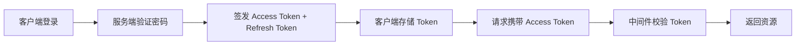

## 概述

本文档记录了 InternWiki 项目中用户认证系统的完整实现过程。从需求分析到方案设计，再到代码实现和测试，一步步说明每个环节做了什么、为什么这么做。

## 为什么需要认证系统

系统之前使用 session-based 认证，存在以下问题：

1. **水平扩展困难** — session 存储在服务器内存，多实例部署需要引入 Redis 共享 session
2. **移动端不友好** — cookie 机制在原生 App 中处理复杂
3. **CSRF 风险** — 基于 cookie 的认证需要额外防护 CSRF

因此决定迁移到 JWT（JSON Web Token）方案。

## 方案设计



### Token 设计

| Token 类型 | 有效期 | 存储位置 | 用途 |
|------------|--------|----------|------|
| Access Token | 15 分钟 | 内存 / localStorage | API 请求认证 |
| Refresh Token | 7 天 | HttpOnly Cookie | 刷新 Access Token |

## 代码实现

### Token 签发

```go
func GenerateTokens(userID string) (string, string, error) {
    accessToken, err := generateAccessToken(userID)
    if err != nil {
        return "", "", err
    }
    refreshToken, err := generateRefreshToken(userID)
    if err != nil {
        return "", "", err
    }
    return accessToken, refreshToken, nil
}
```

### 中间件校验

```go
func AuthMiddleware() gin.HandlerFunc {
    return func(c *gin.Context) {
        token := extractToken(c.GetHeader("Authorization"))
        if token == "" {
            c.AbortWithStatusJSON(401, gin.H{"error": "missing token"})
            return
        }
        claims, err := validateToken(token)
        if err != nil {
            c.AbortWithStatusJSON(401, gin.H{"error": "invalid token"})
            return
        }
        c.Set("userID", claims.UserID)
        c.Next()
    }
}
```

## 踩坑记录

### 1. 并发竞态问题

在实现 token 刷新接口时，多个请求同时刷新会导致旧 token 被多次使用。解决方案：使用 Redis 分布式锁保证刷新操作的原子性。

### 2. Token 过期时间权衡

Access Token 有效期太短会导致频繁刷新，太长则安全性降低。最终选择 15 分钟，在安全性和用户体验之间取得平衡。

## 测试策略

- 单元测试覆盖 token 签发、校验、刷新逻辑
- 集成测试覆盖完整认证流程
- 压力测试验证并发场景下的正确性
