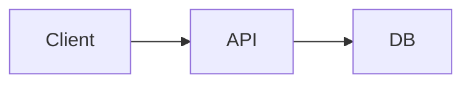

> 写作要点：把读者当成完全不懂你项目的人。目标是让面试官读完觉得「这活确实是他干的」，而且经得起追问。

## 背景

这件事为什么要做？在此之前是什么状况、有什么痛点？
（不要假设读者知道你的业务和技术栈，从零讲起。）

## 我的方案

做了什么、怎么设计的。可以放架构图：



图片放在 `content/interns/junjiawang/assets/` 下，然后这样引用：

<!--  -->

## 关键实现

贴核心代码片段 + 解释为什么这么写。

```ts
// 示例
```

## 踩过的坑

遇到什么报错/问题，怎么定位的，最后怎么解决的。**这部分最值钱**，面试官最爱追问。

## 结果与收获

数据化的效果（性能提升多少、Bug 减少多少），以及你自己的思考。

## 参考

- 
