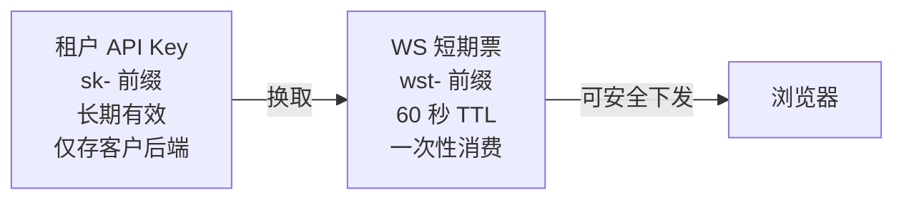

> 本文是 [VoiceAgent 项目总览](docs/voice-agent-overview.md) 的亮点四。这块的核心是**安全设计中的权衡取舍**，面试时最容易被深挖。

## 一、问题：要给浏览器发凭证，但浏览器不可信

平台需要向**浏览器**下发 WebSocket 建联凭证——浏览器里的任何东西用户都能看到（F12 打开就是），所以它是典型的**不可信端**。

两条直觉方案都不行：

| 方案 | 问题 |
|------|------|
| 直接下发租户长期 API Key | 一旦泄露**等同于整个租户身份失守**，而且没法主动吊销（除非重置整个 Key，影响所有业务） |
| 要求所有客户自行集成 HMAC 签名 | 客户要自己管密钥、算签名、处理时钟同步，**接入成本高到劝退** |

**Task（任务）**：在不增加客户密钥管理负担的前提下，把凭证泄露的**爆炸半径**压缩到最小。

> **爆炸半径（blast radius）**：一个凭证泄露后，攻击者能造成多大范围、多长时间的损害。这是安全设计里最核心的度量指标。

## 二、Action：怎么设计的

### 2.1 凭证分层模型



| 凭证 | 前缀 | 生命周期 | 存放位置 |
|------|------|----------|----------|
| 租户 API Key | `sk-` | 长期 | **仅存客户后端**，永不离开可信环境 |
| WS 短期票 | `wst-` | **60 秒** TTL，一次性 | 可下发到浏览器 |

核心效果：**长期密钥永不离开可信服务端**。浏览器手里最多只有一张 60 秒后就失效、且用一次就没了的票。

### 2.2 方案对比：为什么选「不透明票」而不是 HMAC 自签

这是我做过的最重要的一次技术选型，写成了独立设计文档。两个候选：

| | **方案 A · 平台签发不透明票**（选中） | **方案 B · HMAC 自签** |
|---|---|---|
| 票的内容 | `SecureRandom` 生成的 **256 bit 熵**随机串，本身无意义 | 把信息编码进票里 + 签名 |
| 如何验证 | 服务端**查表** | **验签**（不查库） |
| 一次性消费 | ✅ 天然支持（查到就删） | ❌ 做不到（签名永远有效） |
| 主动吊销 | ✅ 删表项即刻失效 | ❌ 做不到（除非另建黑名单） |
| 客户端时钟依赖 | ✅ 完全无依赖 | ❌ 依赖客户端时钟同步 |
| 服务端状态 | 有状态（需 Redis） | 无状态 |

**我的判断**：这个场景里，**爆炸半径控制的优先级高于无状态性**。票要下发到浏览器这种最不可信的环境，「一次性 + 可吊销」是刚需，值得用 Redis 的有状态成本去换。

「客户端时钟不同步」这一点也很实际——HMAC 方案里如果客户手机时间不准，票就会莫名其妙失效或提前过期，这类问题在客服工单里极难定位。

### 2.3 Redis Lua 实现原子消费（面试重点）

「一次性消费」听起来简单：读出来，然后删掉。但**先读后删是有竞态的**：

```
时刻 T1: 请求 A 读到票 → 有效
时刻 T2: 请求 B 读到票 → 也有效（还没被删）
时刻 T3: 请求 A 删除票
时刻 T4: 请求 B 也通过了鉴权 ← 一次性保护完全失效
```

也就是说，**同一张票会被并发建连重复消费**，攻击者只要抢在合法用户前面并发请求，就能白拿一次会话。

我用 **Redis Lua 脚本**把 GET + DEL 合成一个原子操作：

```lua
-- 伪代码示意
local v = redis.call('GET', KEYS[1])
if v then
  redis.call('DEL', KEYS[1])
end
return v
```

Redis 执行 Lua 脚本时是单线程原子的，中间不会插入其他命令，竞态从根源消失。

**为什么不用 GETDEL？** `GETDEL` 命令需要 **Redis 6.2+**，而我们的环境要兼容更低版本。Lua 方案没有版本限制。

### 2.4 纵深防御：不止一道锁

| 措施 | 作用 |
|------|------|
| Redis 中只存 `sha256(票)` 哈希 | **明文票不落库不落缓存**，Redis 被读也拿不到可用票 |
| API Key 同样只存 SHA-256 哈希 | **明文仅创建时返回一次**，我们自己也查不出客户的 Key |
| 签发侧固定窗口限流（默认 60 次/分钟/租户） | 防止被刷票 |
| 失败原因**统一返回 `ok=false`** | 不区分「票不存在」「票已过期」「票已使用」，避免通过错误码差异**反推凭证状态** |

> 最后那条容易被忽略：如果「票不存在」和「票已过期」返回不同错误码，攻击者就能用它当预言机来探测票是否曾经存在。**错误信息本身也是信息泄露渠道。**

### 2.5 三重归属校验：杜绝跨租户越权

所有租户资源操作（Agent / 知识库 / 会话）都遵守一条铁律：

**由 API Key 反解出可信 `orgId`，一律忽略请求体中传入的 `orgId`。**

这和 [配置篇](docs/voice-agent-config-inheritance.md) 里「强制忽略调用方传入的 apikey」是完全一样的思路——**不可信输入不做校验，直接不用。**

在此之上，对 `agentId` 做三重校验：

1. **存在性** — 这个 Agent 真的存在吗
2. **归属** — 它属于当前这个 orgId 吗
3. **启用** — 它当前是启用状态吗

从架构层杜绝跨租户越权，而不是靠每个接口自己记得写判断。

## 三、Result：结果

| 指标 | 改造前 / 朴素方案 | 我的方案 |
|------|-------------------|----------|
| 凭证泄露爆炸半径 | 租户级**永久失守** | **单次会话 / 60 秒窗口** |
| 客户密钥管理成本 | 需集成 HMAC 签名 | **零成本**（复用已有 API Key） |
| 可信服务端接入 | — | 可**跳过换票直连**，省去一次网络往返 |
| 跨租户越权风险 | 存在 | **归零** |
| 并发凭证重放 | 存在 | 通过原子消费**彻底规避** |

风险量级下降了**数个数量级**。

## 四、面试追问预案

**Q：WS Token 为什么不用 JWT？**

JWT 是**自包含验签**方案，它的优势是无状态，但代价是：**无法一次性消费**（签名在有效期内永远可用）、**无法主动吊销**（除非维护黑名单，那就又变有状态了）、**依赖客户端时钟**。

我们的场景要把凭证下发到浏览器，**爆炸半径控制的优先级高于无状态性**。所以选择服务端查表的不透明票，用 Redis 的有状态换取一次性与可吊销能力。

> 补充：如果这个凭证是服务间调用用的、且不需要吊销，JWT 是更好的选择。**选型取决于威胁模型，不存在绝对更优的方案。**

**Q：Lua 脚本 vs GETDEL？**

`GETDEL` 需 Redis 6.2+，Lua 兼容低版本。但**关键不在用哪个，而在必须原子**——先 get 再 delete 存在竞态，同一张票会被并发建连重复消费，一次性保护直接失效。选 Lua 只是兼容性考虑，原子性才是本质需求。

**Q：60 秒 TTL 是怎么定的？会不会太短导致正常用户失败？**

60 秒覆盖的是「客户后端换到票 → 传给前端 → 前端发起 WS 建连」这段路径，正常网络下是秒级完成的，60 秒有充足余量。同时它足够短，让偷到票的攻击者几乎没有可利用窗口。

如果实际监控发现有正常失败（比如弱网用户），我会先看失败分布再调整，而不是凭感觉放宽——**TTL 每放宽一秒都是在扩大爆炸半径**。

**Q：既然票要查 Redis，那 Redis 挂了整个鉴权就挂了，这不是引入了单点吗？**

是，这是有状态方案的固有代价，我接受了它。理由是：Redis 本身是集群高可用部署的；而且鉴权失败的后果是「用户暂时连不上」，属于**可用性问题**；而 JWT 方案下凭证无法吊销的后果是「攻击者拿着票一直能用」，属于**安全问题**。在这个业务里我选择宁可挂掉也不要漏。

**Q：为什么可信服务端可以跳过换票？这不是开了后门吗？**

不是后门，而是**按信任级别分层**。可信服务端本来就持有长期 API Key，它拿着 Key 直连和拿 Key 换票再连，安全性完全等价——票的价值在于保护「Key 不能给的那个环境（浏览器）」。让可信端跳过换票，省的是一次纯粹无意义的网络往返。

## 相关文档

- [VoiceAgent 项目总览](docs/voice-agent-overview.md)
- [三级配置继承体系与 RAG/MCP 编排](docs/voice-agent-config-inheritance.md) — 同源的「忽略不可信输入」原则
- [Agent 全生命周期编排引擎](docs/voice-agent-orchestration.md)
- [事件驱动会话状态机与三层超时兜底](docs/voice-agent-session-lifecycle.md)
- [前后端契约与协同设计](docs/voice-agent-frontend-backend-contract.md) — 「服务端强制忽略 apikey」与「前端 Customized TTS 要填 API Key」为何不矛盾
