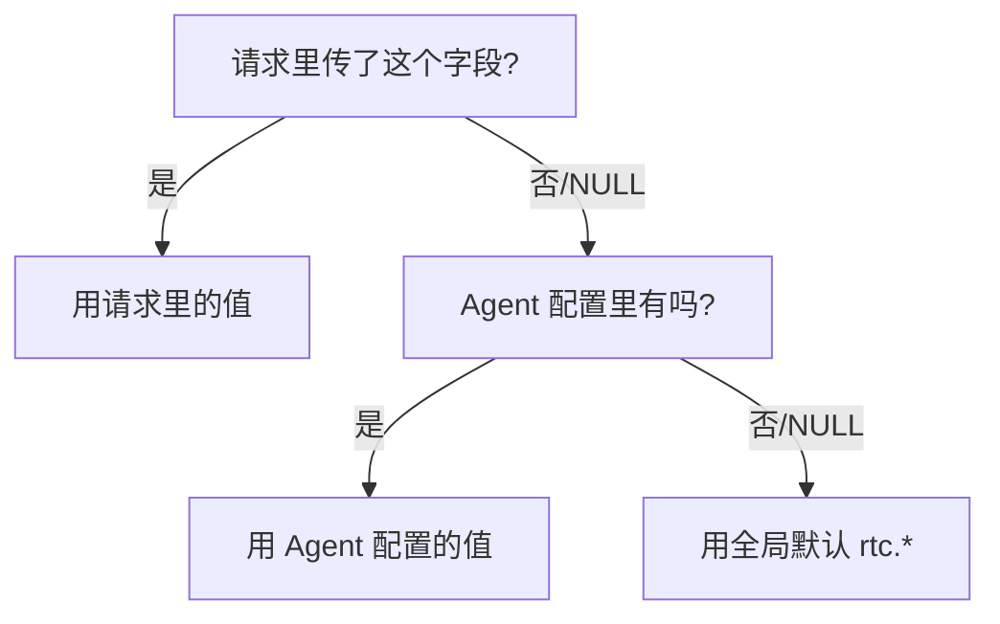

> 本文是 [VoiceAgent 项目总览](docs/voice-agent-overview.md) 的亮点二。名词不熟悉的话，总览里有一张扫盲表。

## 一、这是一个「两头都不能妥协」的矛盾

### 下游引擎很严格

AI Agent 引擎对 `apikey`、`vendor`、`model` 等字段做 **`required` 强校验**。字段是 NULL 就直接拒绝，返回 `7001 Invalid request`。

### 但配置项非常多

智能体一共有 **50+ 可调参数**，分布在这些维度：

| 维度 | 举例 |
|------|------|
| LLM | 模型名、温度、system prompt、最大 token |
| TTS | 音色、语速、音量 |
| ASR | 识别语言、热词 |
| S2S | 一段式模型专属参数 |
| 打断策略 | 是否允许打断、打断灵敏度 |
| 承接词 | AI 思考时先说的「嗯…让我想想」 |
| 静默提醒 | 用户多久不说话时 AI 主动搭话 |
| 环境音 | 背景音效 |

### 两条路都是死路

| 方案 | 后果 |
|------|------|
| 直接把数据库实体下发给引擎 | 大量 NULL 字段 → 下游 `7001 Invalid request`，通话起不来 |
| 把所有字段设为必填 | 租户创建一个智能体要填 50 多个格子，接入成本高到没人愿意用 |

**Task（任务）**：既让租户「只配自己关心的字段」，又保证下发给引擎的报文**永远是完整合法的生效值**。

## 二、Action：三级继承是怎么设计的

### 2.1 核心模型：优先级 + NULL 语义

```
请求级覆盖  >  Agent 持久化配置  >  全局默认(rtc.*)
   最高               中                最低
```

关键在于**把 NULL 的含义统一定义为「回退上一级」**。这一条约定是整个体系的地基：



结果就是：租户**只填 1 个字段**也能创建出一个可用的智能体，剩下 49 个参数自动从全局默认继承。

### 2.2 字段级浅覆盖 vs 整体替换

不是所有配置都适合同一种合并策略，我按语义分成两类：

| 配置项 | 合并策略 | 为什么 |
|--------|----------|--------|
| `asr` / `llm` / `tts` / `s2s` | **按字段浅覆盖** | 我只想改音色，不该被迫重填整个 TTS 配置 |
| `mcpServers` | **整体替换** | 工具列表是一个「集合」，字段级合并会产生「半个工具」这种无意义状态 |

另外有一条硬规则：**强制忽略调用方传入的 `apikey`**。密钥只从服务端可信来源取，从协议层杜绝密钥越权注入。

### 2.3 生效值智能重算（这块最容易被追问）

光把值合并出来还不够——**合并结果可能是「合法但不兼容」的**。所以我在下发前做了两类重算：

**（1）按最终生效模型反推 `vendor`**

租户只填了模型名 `qwen3-omni-flash`，但引擎还要求告诉它这个模型属于哪个 vendor。我根据最终生效的模型名反推：

```
qwen3-omni-flash  →  vendor = thirdparty
```

租户不需要理解 vendor 这个概念。

**（2）不兼容参数强制降级**

有些模型族不支持 `smart_turn`（智能判断用户说完了没）这种高级打断策略。如果租户配了，直接下发会失败。我的处理是**在服务端强制降级为 `server_vad`**（基础的静音检测）。

> 这一步的价值：把「模型与参数不兼容」这类**隐性错误**在服务端提前拦截，而不是让它变成一次失败的通话。租户看到的是「能用」，而不是「报了个看不懂的 7001」。

### 2.4 集成 RAG：让 AI 会查资料

智能体绑定知识库后，服务端**自动在 `llmConfig` 内挂载 `ragConfig`**，包含：

- `kbId` — 知识库 ID
- 检索策略
- 租户隔离信息（保证 A 租户查不到 B 租户的知识库）

租户侧的操作只是「勾选一个知识库」，`ragConfig` 的组装完全由服务端负责。

### 2.5 集成 MCP：让 AI 会用工具

MCP 工具的挂载位置**取决于 pipeline 模式**，这是个容易搞错的点：

| pipeline 模式 | MCP 挂在哪 |
|---------------|-----------|
| 三段式（ASR-LLM-TTS） | `llmConfig` 里 |
| 一段式（S2S） | `s2sConfig` 里 |

原因很直白：三段式里负责「思考和决定调工具」的是 LLM；一段式里没有独立的 LLM 环节，是 S2S 模型自己在做这件事。

另外提供了 `/agent/mcp-tools` 接口**在线解析 MCP Server 的工具清单**，前端可以直接渲染成勾选框，租户不用手写 JSON。

### 2.6 重构复用：抽出 `buildVoiceChatConfig`

原本配置组装逻辑是长在 `buildStartAgentBody`（[编排引擎](docs/voice-agent-orchestration.md)里的那个方法）内部的。后来新增了 WS 链路的 `GetSnapshot` 接口，也需要算出「当前生效配置」。

如果复制一份逻辑过去，两套代码就会**行为漂移**——改了一处忘了另一处，同一个智能体在两个接口下算出不同配置，这种 bug 极难排查。

所以我把配置组装抽离成独立的 `buildVoiceChatConfig`，让 `GetSnapshot` **零成本复用全部生效值计算逻辑**。

## 三、Result：结果

| 指标 | 结果 |
|------|------|
| 支撑的智能体参数数量 | **50+** |
| 租户最少填写字段数 | **1 个**即可创建可用智能体 |
| 配置门槛下降 | 约 **90%** |
| 下游 `7001` 校验失败问题 | **归零** |
| 配置逻辑复用链路数 | **3 条**（RTC 启动 / SIP 外呼 / WS Snapshot） |
| 新链路接入配置能力开发量 | 减少约 **80%** |

## 四、面试追问预案

**Q：三级配置的 NULL 语义如何避免歧义？**

在**表设计阶段**就统一约定「NULL = 回退上一级」，并把这条约定固化在字段注释里，而不是散落在业务代码的判断里。

那么「我就是想显式清空这个字段」怎么办？用**哨兵值 `-`** 表达显式清除，与「未传」严格区分。这一点在全量更新（PUT）场景特别重要——如果不区分，前端一次全量提交就会把用户没动过的字段全部误覆盖成 NULL。

**Q：为什么 mcpServers 要整体替换而不是字段合并？**

因为它的语义是「这个智能体能用哪些工具」，是一个集合而非一组属性。字段级合并会产生「工具 A 的 name 来自请求、url 来自 Agent 配置」这种拼接出来的畸形对象，没有任何意义且极易出错。**合并策略必须匹配数据的语义。**

**Q：为什么要忽略调用方传的 apikey，而不是校验它？**

校验意味着你得判断「这个 key 是不是他有权用的」，这就把一个**协议层的问题**变成了**业务逻辑的问题**，多一处判断就多一处漏洞。直接忽略是最彻底的：密钥只从服务端可信来源取，调用方无论传什么都不生效，**攻击面直接归零**。这和 [鉴权篇](docs/voice-agent-auth.md) 里「一律忽略请求体传入的 orgId、只从 API Key 反解可信 orgId」是同一个原则。

**Q：生效值重算会不会让行为变得不可预测？租户配了 smart_turn 结果被你偷偷改成 server_vad。**

这是个真实的取舍。我的判断是：**能跑起来的降级 > 报错的忠实**。但为了不让它变成「黑盒」，我做了两件事——一是 `GetSnapshot` 接口能让租户随时查到「当前真实生效的配置是什么」，降级是可见的；二是把兼容性规则写进了设计文档。如果重来，我会考虑在响应里带一个 `warnings` 字段显式告知降级原因。

**Q：抽 buildVoiceChatConfig 之前，两套逻辑真的漂移过吗？**

正是因为预见到会漂移才提前抽的。当时 `GetSnapshot` 是新需求，最快的做法就是复制粘贴。我选择先重构再实现，多花了半天，换来的是**配置计算只有一个真相来源**。这类重构的收益不体现在当期，而体现在「第三条链路（SIP 外呼）接入时几乎零成本」。

## 相关文档

- [VoiceAgent 项目总览](docs/voice-agent-overview.md)
- [Agent 全生命周期编排引擎](docs/voice-agent-orchestration.md) — 配置算好之后是怎么下发的
- [多租户分级鉴权与 WS 短期票](docs/voice-agent-auth.md) — apikey / orgId 的可信来源在哪
