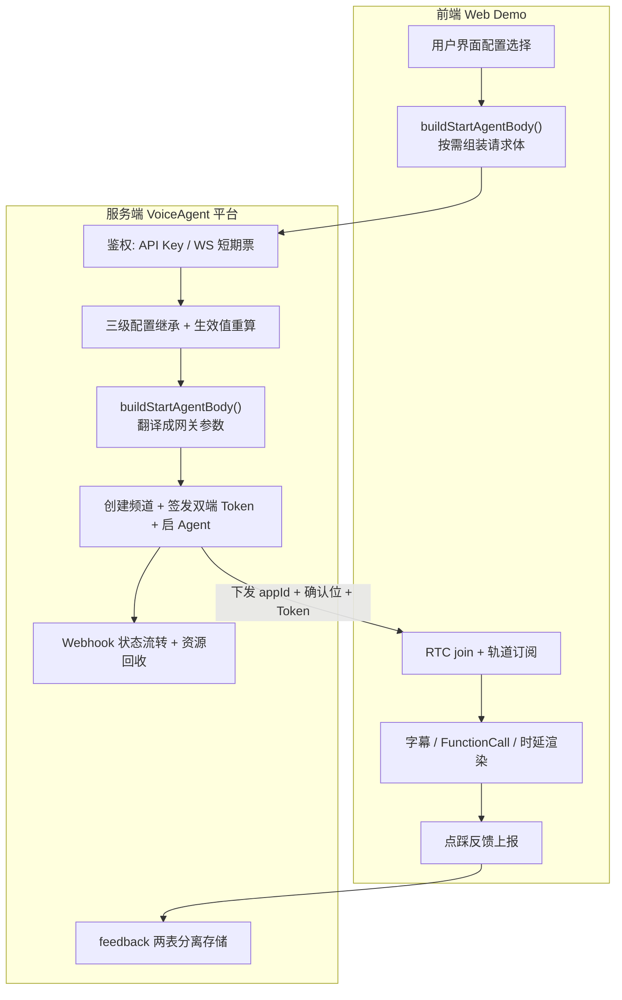
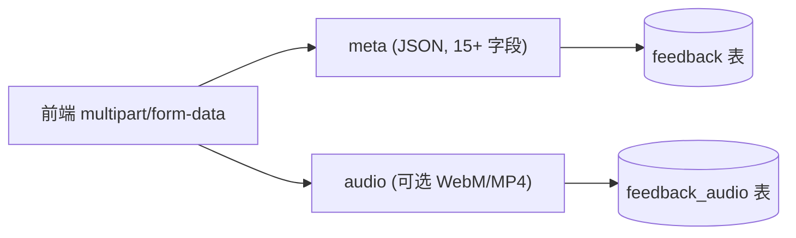

> 这个平台的**服务端和前端 Web Demo 都由我负责**。本文不重复各亮点的实现细节，而是把散落在两侧的**契约与协同设计**集中起来——这些是只看单侧文档看不出来的部分。
>
> 服务端四篇：[编排](docs/voice-agent-orchestration.md) · [配置继承](docs/voice-agent-config-inheritance.md) · [会话状态机](docs/voice-agent-session-lifecycle.md) · [鉴权](docs/voice-agent-auth.md)
> 前端四篇：[数字人](docs/voice-agent-web-digital-human.md) · [模块化重构](docs/voice-agent-web-architecture.md) · [Bad Case](docs/voice-agent-web-badcase.md) · [MCP/RAG](docs/voice-agent-web-mcp-rag.md)

## 一、全景：一次通话里前后端各干什么



## 二、核心契约一：字段级浅覆盖

这是**贯穿前后端最重要的一条约定**，两侧任何一方理解错都会出问题。

### 契约内容

| 表达方式 | 语义 |
|---------|------|
| **字段不出现** | 回退上一级默认值（继承） |
| 字段有值 | 使用该值 |
| 字段为哨兵值 `-` | **显式清除**（区别于「未传」） |

服务端的三级继承链 `请求级 > Agent 级 > 全局 rtc.*` 完全建立在这条约定上，详见 [三级配置继承](docs/voice-agent-config-inheritance.md)。

### 这对前端意味着什么

前端**不能图省事把所有字段都填满**。如果把该缺的字段填成 `null` 或空字符串，服务端的继承链就整体失效了——用户在 Agent 级配好的参数会被请求级的空值覆盖掉。

所以 [`buildStartAgentBody()`](docs/voice-agent-web-architecture.md) 的核心职责就是**按需构造**：该出现的出现，不该出现的**根本不出现这个 key**。

### 一个反直觉的推论

同一个「关闭」意图，在不同字段上要用**不同的写法**：

| 场景 | 前端写法 | 原因 |
|------|---------|------|
| 关闭 RAG | **省略** `ragConfig` | 该字段没有上级默认值，省略即不生效 |
| 关闭 MCP | 下发 **`{}`** | Agent 级可能配了默认 MCP 服务，省略会「关不掉」 |
| 工具全选 | **删除** `allowedTools` | 语义是「不限制」，而非「恰好列举当前全部」 |

判断依据始终是：**这个字段是否存在上级配置**。

而 MCP 用 `{}` 之所以能表达「清空」，是因为服务端对 `mcpServers` 采用的是**整体替换**而非字段合并（工具列表是集合语义，字段级合并会产生「半个工具」）——两侧的策略在这里严格咬合。

## 三、核心契约二：服务端确认位机制

数字人部署在**独立的 RTC App**（不同 appId）下，这带来一个「谁该知道 appId」的职责划分问题。

### 演进过程

| 阶段 | 做法 | 问题 |
|------|------|------|
| 初版 | 前端硬编码数字人专用 appId | appId 变更 / 多环境时 token-appId 不匹配，join 失败 |
| 改造后 | 前端只传 `digitalHuman: true`，服务端下发目标 appId + 确认位 | 彻底消除不匹配 |

### 职责边界


- **前端负责「意图」**，不负责「资源选择」
- **服务端负责「决策」**，因为 appId 属于服务端配置，且随环境变化

服务端侧还有配套设计：用 `ai-dh-` 前缀编码 `agentUserId`，这样后续 stop 时能反推出「这次用的是数字人 appId」，详见 [编排引擎](docs/voice-agent-orchestration.md)。

> **通用原则：配置类信息的知情范围应当最小化。** 前端不知道 appId，就不可能配错 appId。

## 四、两个 `buildStartAgentBody` 的分工

前后端**各有一个同名方法**，这不是重复，而是同一契约的两侧翻译：

| | 前端版 | 服务端版 |
|---|--------|---------|
| **输入** | 用户界面上的选择 + localStorage 配置 | HTTP 请求体 + Agent 持久化配置 + 全局默认 |
| **输出** | HTTP 请求体 | Agent 网关调用参数 |
| **关心什么** | 枚举校验、开关状态、脏数据自净（`getOverride`） | 三级继承、哨兵值、vendor 反推、不兼容降级 |
| **关键约束** | 该缺的字段绝不填 | NULL = 回退上一级 |

两者串起来是一条**逐级收敛**的链路：

```
用户的模糊意图 → (前端) 合法的请求体 → (服务端) 完整的生效值 → 网关
```

前端保证「**不传错**」，服务端保证「**补齐全**」。

## 五、三个容易混淆的语义辨析

这几个点单看一侧文档会觉得矛盾，放在一起才说得清。

### 5.1 前端要填 API Key，服务端却「强制忽略 apikey」？

看起来直接冲突，实际是**两个不同的 key**：

| | 前端 Customized TTS 的 API Key | 服务端忽略的 `apikey` |
|---|---|---|
| 用途 | 用户自带的**第三方 TTS 服务**凭据 | **Agent 引擎**的平台级凭据 |
| 归属 | 用户自己的资源 | 平台的资源 |
| 处理 | 随配置下发 | **一律忽略**，只从服务端可信来源取 |

服务端忽略 `apikey` 的理由是杜绝越权注入（详见 [配置继承](docs/voice-agent-config-inheritance.md)）——如果连用户自带的第三方凭据也一起忽略，Customized TTS 功能就没法用了。**「忽略」的边界是平台凭据，不是所有凭据。**

### 5.2 vendor：前端「路由」vs 服务端「反推」

| 侧 | 做什么 | 为什么 |
|---|--------|--------|
| 前端 | 按 `vendor` 字段**路由下发逻辑**（Aliyun 走音色选择 / Customized 走模型+Key） | 前端知道用户在界面上选了哪个提供方 |
| 服务端 | 按最终生效的**模型名反推** vendor | 服务端拿到的可能是继承出来的模型名，用户从未显式选过 vendor |

两侧的 vendor 语义必须严格对齐，否则会出现「前端下发 Customized，服务端按 Aliyun 解析」的错配。

### 5.3 RAG 为什么两侧都要拦？

| 侧 | 拦法 | 目的 |
|---|------|------|
| 前端 | 端到端链路下**自动禁用并提示用户** | 让用户**知道为什么**不生效（服务端报错的话用户只看到「启动失败」） |
| 服务端 | 按 pipeline 决定 MCP 挂 `llmConfig` 还是 `s2sConfig` | 保证正确性，且不信任任何客户端 |

这不是冗余——**前端拦是为了体验，服务端拦是为了正确性**。前端可以被绕过（改请求、用别的客户端），所以服务端不能省；服务端只能报错，给不出好体验，所以前端也不能省。

## 六、反馈链路：上传协议 ↔ 两表存储

前端点踩上报与服务端存储结构一一对应：



两侧的设计意图是同一个：**让主表保持轻量**。

- 前端：音频是**可选** part，没录到音频也能提交反馈
- 服务端：音频与元数据**分表存储**，避免列表查询拖出 LONGBLOB 影响性能

运营的绝大多数查询（按时间/会话/配置筛 bad case）不需要音频，只在需要复现时才按需取。

其中 `offsetMs`（点踩时刻相对会话开始的毫秒偏移）是把「几分钟录音」变成「直接跳到出问题那一秒」的关键字段。详见 [Bad Case 反馈系统](docs/voice-agent-web-badcase.md)。

## 七、一条贯穿两侧的设计思路

回头看，前后端有几处解法**结构上完全同构**：

| 问题 | 前端解法 | 服务端解法 | 共同思路 |
|------|---------|-----------|---------|
| 事件可能漏 | `user-published` 监听 + **500ms 轮询兜底** | 104 实时事件 + **30s 定时扫描兜底** | 事件负责快，轮询负责不漏 |
| 外部数据不可信 | `getOverride` 校验 localStorage 脏数据 | 忽略请求体传入的 `apikey` / `orgId` | 不信任任何跨边界数据 |
| 可观测性 | 旁路写入 `convLog`（挂在真实渲染路径上） | 时延指标随 RTM 下发 | 观测数据挂真实路径，不另造一条 |
| 用户可预期的错 | 自动拉平 MCP 的 `servers` 嵌套 | 不兼容参数强制降级 `smart_turn → server_vad` | 高频可预期的错，在系统层消化 |

> **这不是巧合。** 前端面对的是「浏览器环境和用户输入不可控」，服务端面对的是「上下游系统和调用方不可控」——都是「在不可信边界上建立确定性」这同一类问题，所以解法同构。

## 八、面试追问预案

**Q：前后端都是你做的，那契约是怎么定的？会不会因为一个人做就随意了？**

恰恰相反，正因为两侧都是我，**契约必须写得更明确**——否则过两周我自己就会记错。所以浅覆盖语义、哨兵值 `-`、确认位机制这些都固化在设计文档和字段注释里，而不是「我知道就行」。

一个人做两侧的真实好处是能发现**只有跨侧才暴露的问题**。比如「MCP 关闭要下发 `{}` 而 RAG 关闭要省略字段」这个反直觉的结论，如果两侧分属两人，前端很可能统一用一种写法然后踩坑。

**Q：既然前端会拦 RAG 在端到端下的不兼容，服务端为什么还要处理？重复劳动。**

因为**前端校验永远不能替代服务端校验**。前端拦的目的是给用户一个能看懂的提示；服务端拦的目的是保证正确性——任何人都可以绕过前端直接调接口。这是安全和健壮性的基本原则：客户端校验是体验优化，服务端校验才是约束。

**Q：把 appId 决策放到服务端，前端就完全不知道自己在连哪个 App，排障会不会更难？**

服务端在响应里下发了目标 appId，前端**知道结果但不做决策**。所以排障时前端日志里有完整的 appId 信息，不影响定位。区别在于「知情」和「决策权」是分开的——前端可以知道，但不能选。

**Q：前后端同名方法 `buildStartAgentBody`，不会让人混淆吗？**

会有一点，但同名恰恰传达了正确信息：**它们在各自层级扮演同一个角色**——把上游的意图翻译成下游的契约。如果起不同的名字，反而掩盖了这层对应关系。实际讨论时用「前端的 build」「服务端的 build」区分，没有造成过实际困扰。

**Q：这套契约最脆弱的地方在哪？**

浅覆盖语义**依赖两侧同时正确**，而它是一条「约定」而非「机制」——没有任何编译期或运行期检查能防止前端多填一个空字段。

如果要加固，方向是把契约变成可执行的：比如用共享的 schema 定义（JSON Schema / IDL）生成两侧代码，或在服务端对「显式传了 null」的字段做告警。当时受项目节奏和「前端零构建」约束没做，这是我认为最值得补的一块。

## 相关文档

- [VoiceAgent 项目总览](docs/voice-agent-overview.md) — 从这里开始读
- 服务端：[编排](docs/voice-agent-orchestration.md) · [配置继承](docs/voice-agent-config-inheritance.md) · [会话状态机](docs/voice-agent-session-lifecycle.md) · [鉴权](docs/voice-agent-auth.md)
- 前端：[数字人](docs/voice-agent-web-digital-human.md) · [模块化重构](docs/voice-agent-web-architecture.md) · [Bad Case](docs/voice-agent-web-badcase.md) · [MCP/RAG](docs/voice-agent-web-mcp-rag.md)
