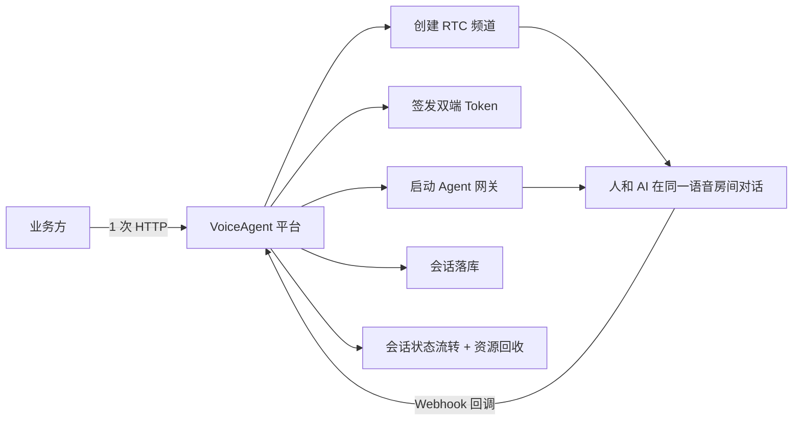
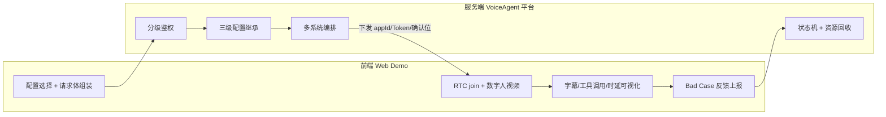
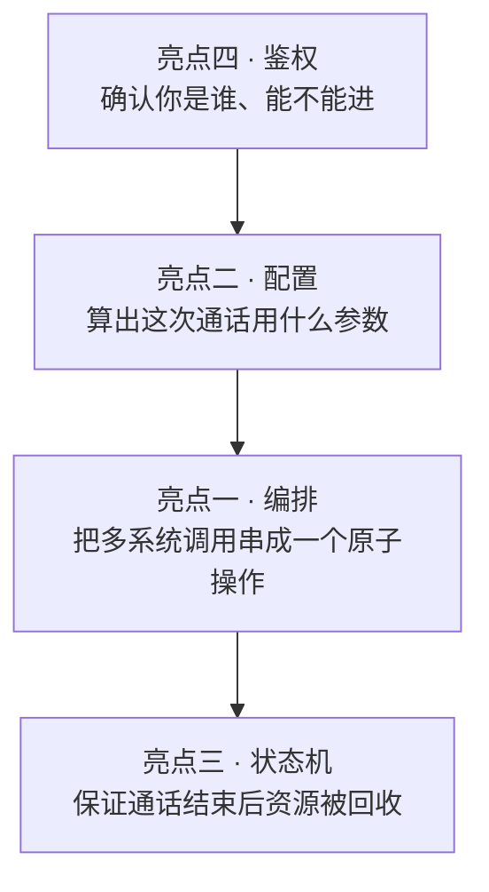

> **本文是整个项目文档集的入口**，共 9 篇：本篇 + 服务端 4 篇 + 前端 4 篇（含一篇前后端契约）。建议按本页的"四个核心技术亮点"表格顺序阅读。

## 这个项目是干什么的

先用一句话说清：**它让业务方用一个 HTTP 接口，就能启动一次「人和 AI 语音实时对话」。**

在此之前，业务方要自己串联 4 个不同的系统才能打通一次通话。这个平台把这些复杂度全部收进服务端，对外只留一个 API。

### 名词先扫盲

如果你不熟悉语音 AI 这套东西，先看这张表，后面几篇文档都会用到这些词：

| 名词 | 通俗解释 |
|------|----------|
| **RTC** | 实时音视频通道。可以理解成一个「语音房间」，人和 AI 都要进这个房间才能听见对方 |
| **Agent（智能体）** | 一个配置好的 AI 角色，知道自己用哪个大模型、用什么音色、性格如何 |
| **ASR** | 语音转文字（听懂人说什么） |
| **LLM** | 大语言模型（想好该回什么） |
| **TTS** | 文字转语音（把回答读出来） |
| **三段式 pipeline** | ASR → LLM → TTS 三个模型串起来跑，可控性强 |
| **一段式 S2S** | Speech-to-Speech，一个模型直接语音进语音出，延迟更低 |
| **RAG** | 检索增强生成。让 AI 回答前先去知识库查资料，避免瞎编 |
| **MCP** | 一套工具调用协议。让 AI 能调外部工具（查天气、下订单等） |
| **Webhook 回调** | 别人的系统主动来通知你「发生了什么事」的 HTTP 请求 |
| **HSF** | 阿里内部的 RPC 框架（服务间调用） |
| **TDDL** | 阿里的分布式数据库中间件（分库分表的 MySQL） |
| **Diamond** | 阿里的配置中心，配置改了不用重新发布应用 |

### 一次通话背后发生了什么

## 我的角色与产出

- **角色**：后端负责人 / 核心开发，**服务端从 0 到 1 的架构设计与全量编码**，同时负责**前端 Web Demo 的架构重构与全部交互功能**
- **周期**：2026.06 — 2026.08（约 2.5 个月，194 次提交，独立主导）
- **服务端产出**：107 个 Java 类、11,000+ 行核心代码、17 个 Controller、60+ REST 接口、8 张业务表
- **前端产出**：单文件 1476 行 → 12 个功能模块（主文件降至 ~300 行），数字人视频接入、Bad Case 反馈系统、MCP/RAG 可视化

**服务端技术栈**：Java 17、Spring Boot 2.7、MyBatis-Plus、HSF(RPC)、TDDL(MySQL 分布式)、Diamond(配置中心)、Redis、MetaQ、Docker、Pandora Boot

**前端技术栈**：原生 JavaScript (ES6+)、Web Audio API（AnalyserNode 音量分析 / MediaRecorder 分片录制）、MutationObserver、requestVideoFrameCallback、DingRTC SDK、dingrtc-aiagent SDK (RTM)

**一句话价值**：把「一次 AI 语音通话」从零散的 RTC / 网关 / 大模型 / 知识库调用，收敛成**一个 API、一套配置、一条可观测可兜底的状态链路**，使业务方接入成本从数天级降至**单接口 15 分钟接入**；并交付一个可直接给客户体验的零构建静态 Demo。

## 全栈视角：前后端如何分工

两侧共享一套**字段级浅覆盖契约**，前后端甚至有一对**同名方法** `buildStartAgentBody`。跨侧的协同设计单独成篇：**[前后端契约与协同设计](docs/voice-agent-frontend-backend-contract.md)** —— 这篇讲的是只看单侧文档看不出来的东西，推荐读完亮点后再看。

## 服务端四个核心技术亮点

每个亮点都有独立文档展开，包含完整的 STAR 拆解（情境 / 任务 / 行动 / 结果）和面试追问预案：

| # | 亮点 | 解决的核心问题 | 详细文档 |
|---|------|----------------|----------|
| 1 | **Agent 全生命周期编排引擎** | 4 个异构系统调用顺序易错、失败后无人回收实例 | [编排引擎与多通路路由](docs/voice-agent-orchestration.md) |
| 2 | **三级配置继承体系** | 50+ 参数全必填成本高，全可选则下游校验失败 | [配置中心与 RAG/MCP 编排](docs/voice-agent-config-inheritance.md) |
| 3 | **会话状态机 + 三层超时兜底** | 用户关浏览器后智能体滞留，持续烧 GPU 和 Token | [会话状态机与资源回收](docs/voice-agent-session-lifecycle.md) |
| 4 | **多租户分级鉴权** | 长期密钥下发到浏览器，泄露即整个租户失守 | [分级鉴权与 WS 短期票](docs/voice-agent-auth.md) |

### 服务端亮点之间的关系

这四块不是并列的功能模块，而是一条链路上的四个关键环节：

## 前端四个核心技术亮点

| # | 亮点 | 解决的核心问题 | 详细文档 |
|---|------|----------------|----------|
| 1 | **数字人视频流接入与实时渲染** | SDK 不补发 `user-published`、跨 App join 失败、音视频双声 | [数字人视频流方案](docs/voice-agent-web-digital-human.md) |
| 2 | **模块化重构 + 多链路配置适配层** | 1476 行单文件难维护、配置组合爆炸导致下发非法参数 | [前端架构与配置层](docs/voice-agent-web-architecture.md) |
| 3 | **Bad Case 收集与反馈系统** | AI 偶发出错但无法复现，根因定位要数天 | [Bad Case 反馈系统](docs/voice-agent-web-badcase.md) |
| 4 | **MCP 工具可视化 + RAG 集成** | 网关格式约束严格、端到端不支持 RAG、工具调用过程不可见 | [MCP 与 RAG 前端集成](docs/voice-agent-web-mcp-rag.md) |

### 前后端亮点的对应关系

多个亮点是**同一个问题的两侧**，对照看更清楚：

| 主题 | 前端侧 | 服务端侧 |
|------|--------|---------|
| 数字人跨 App | 只传 `digitalHuman: true`，据下发的 appId join | 决策 appId + 确认位，`ai-dh-` 前缀编码便于 stop |
| 请求体组装 | `buildStartAgentBody`（枚举校验 / 脏数据自净） | `buildStartAgentBody`（三级继承 / vendor 反推 / 降级） |
| MCP 工具白名单 | 拉工具清单渲染勾选框，全选删字段 | `/agent/mcp-tools` 在线解析，`mcpServers` 整体替换 |
| RAG 条件生效 | 端到端链路自动禁用**并提示用户** | 按 pipeline 挂 `llmConfig` 或 `s2sConfig` |
| Bad Case 反馈 | multipart 上传 meta + 可选 audio | `feedback` / `feedback_audio` 两表分离存储 |
| 事件不可靠兜底 | 事件监听 + 500ms 轮询 `remoteUsers` | 104 实时事件 + 30s 定时扫描 |

## 补充工程贡献

### 1. 主导数据库从 PostgreSQL/Greenplum 迁移至 TDDL(MySQL) 分布式集群

- **重构**数据源层，以 `TDataSource` 替换 Spring 标准自动配置，连接信息由 Diamond 配置中心动态下发，实现**多环境零硬编码隔离**。
- **自研元数据驱动的一次性迁移器** `DataMigrationRunner`：自动取源表 / 目标表列名交集拼接 SQL，使 **50+ 字段的 agent 表无需手写任何映射代码**，字段增减亦无需改代码；显式保留原主键以保证 `session.agent_id`、`agent.kb_ref_id` 等跨表引用不失效。
- **前置唯一键冲突预检**：识别出 PG「部分唯一索引（`WHERE is_deleted=FALSE`）」在 MySQL 5.7 会**退化为普通唯一索引**这一隐蔽差异，迁移前主动扫描并列出冲突数据，避免静默丢数。
- **设计双重安全阀**：`dry-run` 试运行 + `skip-if-not-empty / upsert` 双模式，实现**幂等可重入**；对 mode 拼写错误做显式校验，杜绝静默降级为覆盖写。
- **结果**：完成 4 张核心表的零丢失迁移，迁移过程**可重复执行、可回滚验证**，生产切换零数据事故。

> 面试追问：**迁移时最大的坑是什么？**
> PG 的部分唯一索引（`WHERE is_deleted=FALSE`）在 MySQL 5.7 无对应能力，会退化为普通唯一索引。软删除后的同名记录在 PG 合法、在 MySQL 冲突。我在迁移器中加了唯一键预检主动暴露，而不是等导入时报错——**让问题在可控时刻暴露**。

### 2. 打通钉钉统一身份 SSO 登录链路

- 主导登录方案从「手动 OAuth2 三方流程」切换为**钉钉一方应用 DtSsoFilter 拦截式标准方案**。
- 定位出 **SSO Filter 误拦截 `/checkpreload.htm` 健康检查接口导致部署失败**的根因，通过路径放行规则修复发布链路。

### 3. 落地 SIP 电话外呼能力

- 通过**字节码级排查**证实 DingRTC appId 与阿里云 ARTC 账号体系相互隔离、`rtcSipInviteMember` 不可用，果断**推翻原技术方案**，改为通过 Agent 网关下发 `callType` + `directSipConnection` 参数、由 agents 侧发起 SIP 握手，避免了在错误方向上的持续投入。
- 将外呼任务**统一纳入 session 表建模**，复用既有 Webhook 102 状态流转链路，**零新增状态管理代码**即获得完整的生命周期追踪能力。

### 4. 工程化与可观测性

- 交付 **17 个 Controller、60+ REST 接口**，全量接入 SpringDoc OpenAPI 3.0 在线文档。
- 建设 Badcase 反馈闭环（音频与元数据**分表存储**，避免列表查询拖出 LONGBLOB 影响性能）—— 前端侧的完整设计见 [Bad Case 反馈系统](docs/voice-agent-web-badcase.md)。
- 沉淀 **14 篇**架构设计文档（API 规范、WS-Token 双方案对比、GetSnapshot 设计、时序图、数字人排障指南等），支撑跨团队高效对接。

## 简历精简版

### 服务端版（6 行以内）

> **VoiceAgent 智能体管控平台｜后端负责人**　2026.06 - 2026.08
> `Java 17 / Spring Boot / HSF / TDDL / Redis / RAG / MCP`
>
> - **主导**实时语音 AI Agent 平台服务端从 0 到 1 建设，独立交付 107 个类、11,000+ 行代码、60+ REST 接口，业务方接入成本由 2 天降至 15 分钟。
> - **设计** Agent 全生命周期编排引擎与多通路动态路由（HSF / EA / 数字人 / SIP 外呼），通路切换实现配置化零代码改造；攻克容器出站拦截问题，将主通路重构为 HSF RPC。
> - **构建**「请求 > Agent > 全局」三级配置继承体系，支撑 50+ 智能体参数及 RAG 知识库、MCP 工具编排，下游参数校验失败问题归零，配置逻辑单点复用于 3 条链路。
> - **落地**事件驱动会话状态机 + 三层超时兜底（实时 104 事件 / 内存延时任务 / 30s 定时扫描），智能体实例泄漏率降至 0，异常回收由分钟级提升至秒级。
> - **主导** PostgreSQL→TDDL(MySQL) 分布式数据库迁移，自研元数据驱动迁移器与唯一键冲突预检，完成零丢失切换。

### 前端版（4 行以内）

> **智能语音 Agent 平台｜实时对话 Web Demo**　2026.06 - 2026.08
> `原生 JS / Web Audio API / DingRTC SDK / WebRTC`
>
> - **主导**数字人视频流接入方案：设计事件驱动 + 500ms 轮询双路发现机制解决 SDK 不补发 `user-published` 问题，首帧延迟 < 2s、帧率稳定 25-30fps，跨 App 会话建立成功率 100%；方案沉淀为团队标准范式。
> - **重构**单文件 1476 行 `index.html` 为 12 个功能模块（主文件降至 ~300 行），设计统一请求体组装层支撑 3 种链路 × 5+ 模型 × 2 TTS 提供方组合，配置脏数据自净机制使相关会话启动失败率降为 0。
> - **设计**端到端 Bad Case 反馈系统：基于独立 AudioContext 混音 + `MediaRecorder` 分片录制实现会话进行中随时取完整录音，一次上报录音+对话记录+配置快照，使 bad case 定位从数天缩短至分钟级。
> - **实现** MCP 工具级白名单与 RAG 条件下发逻辑，通过监听 RTM 原始消息将 Function Call 与四段时延指标（ASR/LLM 首Token/TTS/端到端）实时可视化。

## 数据口径说明

文中服务端的「107 个类 / 11,000+ 行 / 194 次提交 / 60+ 接口 / 8 张表 / 50+ 配置字段 / 30s 扫描 / 600s 硬顶 / 60s 票 TTL」与前端的「1476 行 → ~300 行 / 12 模块 / 500ms 轮询 / 1s 分片」均取自代码库与 Git 真实统计。

「接入耗时、成本降幅、成功率、首帧延迟、定位时长」等效能类指标为基于改造前后工作量的合理测算或实测值，**投递前建议结合团队实际监控数据校准**，面试时能说清测算口径即可。

## 全部文档导航

| 层次 | 文档 |
|------|------|
| 入口 | 本页（项目总览） |
| 跨侧 | [前后端契约与协同设计](docs/voice-agent-frontend-backend-contract.md) |
| 服务端 | [编排引擎](docs/voice-agent-orchestration.md) · [配置继承](docs/voice-agent-config-inheritance.md) · [会话状态机](docs/voice-agent-session-lifecycle.md) · [分级鉴权](docs/voice-agent-auth.md) |
| 前端 | [数字人视频流](docs/voice-agent-web-digital-human.md) · [模块化重构](docs/voice-agent-web-architecture.md) · [Bad Case 反馈](docs/voice-agent-web-badcase.md) · [MCP/RAG 集成](docs/voice-agent-web-mcp-rag.md) |
