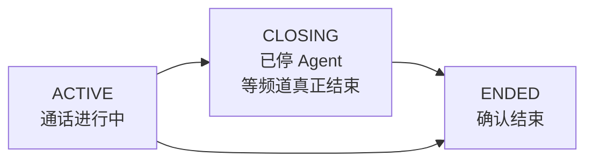
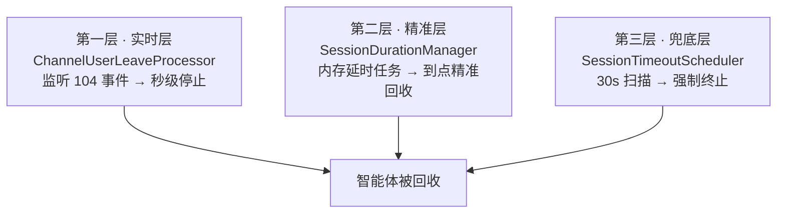

> 本文是 [VoiceAgent 项目总览](docs/voice-agent-overview.md) 的亮点三，也是我个人认为工程含量最高的一块。

## 一、这个问题为什么难

### 用户关掉浏览器，钱还在烧

一次 AI 语音通话跑起来后，智能体实例是**真实占用 GPU 和大模型 Token** 的。理想情况下用户挂断，我们就调 stop 接口回收。但现实中：

| 异常路径 | 后果 |
|----------|------|
| 用户直接关掉浏览器标签页 | 前端来不及发 stop 请求 |
| 用户断网 / 手机没电 | 同上，而且完全没有信号 |
| 网关回调丢失 | 我们以为还在跑，其实早结束了（或反之） |
| 我们的服务重启 | 内存里的定时任务全丢 |

智能体就这样**滞留在 RTC 频道里持续烧钱**。

### 协议层堵不住

我第一反应是「让下游网关自己管超时」。查了协议后发现不行：网关的 `userInactivityTimeout` **上限只有 180 秒**，而且它是「用户不说话超时」，不是「绝对最大会话时长」。一个用户可以一直说话说 3 小时，这个参数拦不住。

**结论**：下游不支持绝对最大时长，**必须在我们这一层自己实现**。

**Task（任务）**：在回调不可靠、客户端不可信的前提下，保证任何异常路径下智能体都能被确定性回收。

## 二、Action：三件事

### 2.1 三态会话状态机



**为什么要有 CLOSING 这个中间态？**

因为「我们本地把 Agent 停了」和「RTC 频道真的结束了」之间有一个**时间窗口**。在这个窗口里，会话既不是 ACTIVE（我们已经动手停了）也不是 ENDED（还没收到确认）。如果只用两态，这个窗口里的状态就是撒谎。

**唯一最终判据**：只有**频道结束 Webhook（事件 102）**才能把会话置为 ENDED。其他任何操作都不行。这条规则让「什么时候算真的结束」有了单一权威来源。

**所有中间态操作都是幂等的**：用条件更新（`UPDATE ... WHERE status = 期望值`），**命中 0 行就直接忽略**，不报错、不重试。

> 幂等为什么关键？因为 Webhook 会重复推、会乱序到达。如果不幂等，一条 102 推 3 次就可能把已经流转到别的状态的会话又拽回去，产生脏数据。**幂等是分布式回调场景的入场券，不是优化项。**

### 2.2 策略模式的事件处理框架

Webhook 会推过来好几类事件（101 频道创建 / 102 频道结束 / 104 用户离会 / 3003 …）。最直觉的写法是在入口写一串 `if-else`：

```java
// 反面例子：不要这样写
if (eventType == 101) { ... }
else if (eventType == 102) { ... }
else if (eventType == 104) { ... }
```

问题有两个：**每加一种事件就要改这个方法**（违反开闭原则），而且**任何一个分支抛异常，整个 Webhook 响应就挂了**——一类事件的 bug 会连带影响所有事件。

我的做法是抽一个接口：

```java
public interface RtcEventProcessor {
    boolean match(String eventType);   // 我管不管这个事件
    void process(RtcEvent event);       // 怎么处理
}
```

四个实现类（101 / 102 / 104 / 3003）注册为 Spring 组件，Webhook 入口拿到事件后遍历所有处理器、按 `match` 自动分发。

两个关键收益：

- **单个处理器异常完全隔离** — 用 try-catch 包住每个处理器的执行，一个挂了不影响其他处理器和整体响应
- **新增事件类型无需改动分发逻辑** — 新建一个类、加上 `@Component` 就自动生效

### 2.3 三层超时兜底防线

这是整个设计的核心。**没有任何单一机制能覆盖所有异常路径**，所以我叠了三层，每层负责不同的目标：



**第一层：实时层（管「快」）**

`ChannelUserLeaveProcessor` 监听 104 用户离会事件。识别到**真人用户**异常离会后，**秒级主动停止**智能体。

这里有个必须处理的细节：**要排除 Agent 自己离开的事件**。因为智能体停止时它自己也会触发 104，如果不排除就会形成「停止 → 收到 104 → 又去停止」的自触发循环。

**第二层：精准层（管「准」）**

`SessionDurationManager` 基于 `ScheduledExecutorService` + `ConcurrentHashMap` 维护每个会话的内存延时任务，支持 **5 / 10 / 30 分钟**可选体验时长档位。

- 到点**精准回收**（误差在毫秒级）
- **不侵入表结构**（不需要为「预约几点停」加字段）

**第三层：兜底层（管「不漏」）**

`SessionTimeoutScheduler` 每 **30 秒**定时扫描数据库：

| 检查项 | 动作 |
|--------|------|
| 会话时长 > **600 秒**（硬顶） | 强制终止 |
| CLOSING 状态超过 **120 秒**还没收到 102 | 直接置为 ENDED（判定为僵死） |

这一层专门覆盖**服务重启导致内存任务丢失**的场景——第二层的定时任务在内存里，重启就没了，但数据库里的会话记录还在，扫描一定能发现它。

### 2.4 网关兜底通道

停止失败时**自动降级至备用通路重试**（HSF 失败降 HTTP，或反之），确保「回收」这个关键动作不因单通路故障而彻底失效。这依赖 [编排引擎](docs/voice-agent-orchestration.md) 里那个门面层——两条通路请求体一致，切换才可能零成本。

## 三、Result：结果

| 指标 | 结果 |
|------|------|
| 智能体实例泄漏率 | **降至 0** |
| 异常离会回收延迟 | 从「依赖网关超时的分钟级」→ **秒级** |
| 会话状态最终一致性 | **100%**（重复 / 乱序回调不再产生脏数据） |
| 新增一类 RTC 事件的成本 | **1 个处理器类，约 30 行**，不改任何既有代码 |
| 事件扩展成本降低 | 约 **85%** |

## 四、面试追问预案

**Q：为什么用状态机而不是简单的开始 / 结束两态？**

`CLOSING` 中间态解决的是「本地已停 Agent，但 RTC 频道尚未真正结束」的不一致窗口。两态模型在这个窗口里无法表达真实状态，只能撒谎（说还在跑或说已结束，都不准）。

以 **102 回调为唯一最终判据 + 幂等更新**，保证乱序 / 重复回调不产生脏数据。而且有了 CLOSING，第三层兜底才能识别出「卡在 CLOSING 超过 120 秒 = 僵死」这种特定异常。

**Q：内存延时任务重启就丢了，怎么办？**

这正是三层兜底的设计动因：**内存任务负责「精准」，定时扫描负责「不漏」**。

30s 扫描 + 600s 硬顶 + 120s 僵死兜底，完整覆盖重启场景。代价是最长 **30 秒**的回收延迟——我用这个可接受的延迟，换取了架构的简单性（**无需引入分布式定时中间件**）。如果业务要求回收延迟必须 < 5 秒，那才值得上分布式调度。

**Q：为什么不干脆全用定时扫描，省掉内存任务那一层？**

因为体验时长档位（5 / 10 / 30 分钟）是**对用户承诺的**。如果只靠 30 秒扫描，用户买的 5 分钟体验可能变成 5 分 29 秒。内存任务保证承诺的精准兑现，扫描保证承诺在异常时也不失效。**两层解决的是不同问题，不能互相替代。**

**Q：策略模式在这里是不是过度设计？才 4 种事件。**

如果永远只有 4 种，if-else 确实够。但我做这个决策时的判断依据是：RTC 事件类型是**下游协议定义的、会持续增加的**（协议文档里列了十几种，我们先接了 4 种）。更重要的是**异常隔离**——if-else 做不到「一个分支挂了不影响其他分支和整体响应」，除非每个分支都套 try-catch，那代码反而更难看。**策略模式在这里同时解决了扩展性和隔离性两个问题。**

**Q：104 事件排除 Agent 自身离会，你是怎么发现这个坑的？**

联调时发现日志里 stop 被调了两次。追下去发现智能体停止后自己也会触发 104 离会事件，处理器不加区分就会再次触发停止。虽然第二次停止因为幂等设计不会造成状态错乱，但会产生一次无用的网关调用和一堆噪音日志。**幂等救了我，但不该让它去救这种本可以在源头避免的问题。**

## 相关文档

- [VoiceAgent 项目总览](docs/voice-agent-overview.md)
- [Agent 全生命周期编排引擎](docs/voice-agent-orchestration.md) — 启动侧，以及回收依赖的门面层
- [三级配置继承体系与 RAG/MCP 编排](docs/voice-agent-config-inheritance.md)
- [多租户分级鉴权与 WS 短期票](docs/voice-agent-auth.md)
