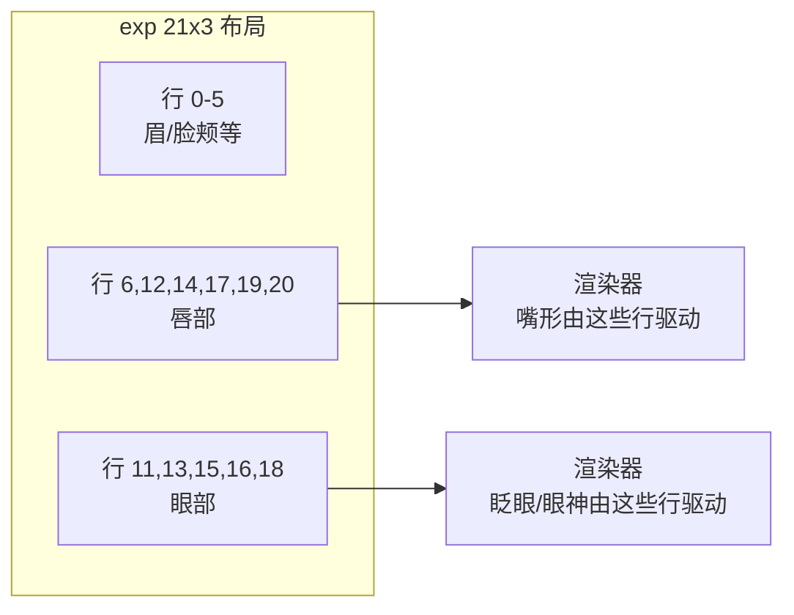

> 前置阅读：[数字人基础](数字人基础.md) 3.2 节。本文回答三个问题：动作空间有哪些表示？Ditto 是怎么把眼部和嘴部拆开的？这些表示各自从哪来？

## 一、表示谱系：显式 ↔ 隐式光谱

所有动作空间表示可以排在一条"语义可读性"光谱上：

| 表示 | 维度/形式 | 语义可读性 | 代表工作 |
|------|----------|-----------|---------|
| **3DMM 系数（BFM/FLAME）** | 表情系数 + 头姿系数 | 高——每维有明确语义 | SadTalker、FLAP |
| **Blendshape 系数** | ARKit 52 维等 | 高——工业标准接口 | LiteAvatar（32 维口型） |
| **显式关键点** | keypoints + rotation + translation | 中——位置可解释但无逐维语义 | Ditto |
| **隐式关键点** | LivePortrait 紧凑关键点 | 低——"implicit blendshapes" | LivePortrait |
| **整体面部 latent** | 512 维向量 | 低——但可显式分解 | VASA-1、FLOAT |
| **资产接口** | SMPL-X / ARKit / BVH / motion tokens | 高——跨软件通用 | 3D avatar 生态 |

光谱两端的取舍：**显式**端可解释、可编辑、可直接接游戏引擎/直播软件的工业管线；**隐式**端容量大、表达上限高，但改一个"眼神"都不知道动哪个维度。

几个关键细节：

- **FLAME 系数语义清晰**：全局头部旋转、眼睛、下颌、眼睑、表情 blendshape 都可以单独读写——FLAP 正是用这一点把 FLAME 系数放进扩散模型做可控条件
- **FLAME 顶点自带 blendshape + LBS skinning**：LAM 把 Gaussian avatar 重建在 FLAME canonical space，每个 Gaussian 继承顶点的形变权重，FLAME 系数可以直接驱动 3DGS
- **FLAME UV 空间是"空间对齐的工作区"**：FlexAvatar 用 50×50 UV 网格（2500 token）让每个 token 天生负责头部一个固定区域；UIKA 的 canonical UV 让不同人的特征在统一坐标系下可比
- **隐式关键点学出"implicit blendshapes"**：LivePortrait 的经验发现——紧凑隐式关键点没有 3DMM 那样的显式语义维度，但小型 MLP 能学出「眼睛更开一点」「嘴巴闭合一点」这样的局部形变 offset。Ditto 借这个机制实现了 gaze/emotion/pose 细粒度控制

## 二、核心问答：Ditto 怎么把眼部和嘴部拆开？

这是理解"动作空间拆分"最典型的问题。答案不是某个训练魔法，而是**四层机制的叠加**：

### 第一层：表示层——分区是继承来的，不是训出来的

Ditto 的 motion space 直接来自预训练的 LivePortrait 风格 Motion Extractor。exp 通道是 **21×3 布局**（21 个语义关键点区域 × xyz），每个"行"对应面部的固定区域：



唇部固定在行 [6,12,14,17,19,20]，眼部固定在行 [11,13,15,16,18]（源码 `motion_stitch.py:149-150`）。这个语义分区是 motion extractor 预训练时就固化在表示里的——Ditto 拿来就用，不需要自己学。

### 第二层：条件层——按"音频能不能解释"拆

音频和嘴动强相关（音素决定口型），但解释不了眨眼和视线。所以训练时的条件信号按可解释性拆分：

| 条件信号 | 来源 | 作用 |
|---------|------|------|
| 音频特征 | HuBERT | 决定口型、语速、节奏 |
| **眼部状态 e** | aspect ratio + pupil position | 单独抽出走 cross-attention，控制眨眼和 gaze |
| 参考 keypoints | Motion Extractor | 把 motion 适配到目标身份几何 |
| emotion label | clip 级标注 | 表情强度与风格 |

眼部运动交给显式条件 e，嘴部交给音频——这就是"拆"的条件层。

### 第三层：Loss 层——按区域分组调权（adaptive loss weights）

嘴、眼、表情、头姿的运动幅度、收敛速度、与音频的相关性都不同。统一 loss 权重会让某区域训练不足。Ditto 按控制区域对 motion representation 分组，根据**相邻 epoch 的平均 loss 差异**动态调整各组权重，再经 softmax 得到调整系数。这是论文消融中影响很大的一项。

### 第四层：推理层——区域 alpha mask 混合

源码里用 0/1 alpha mask 按区域混合"驱动值"与"源值"（`_fix_exp_for_x_d_info`）：

```python
_eye = [11, 13, 15, 16, 18]
_lip = [6, 12, 14, 17, 19, 20]
alpha = np.zeros((21, 3)); alpha[_lip] = 1
x_d_info["exp"] = x_d_info["exp"] * alpha + x_s_info["exp"] * (1 - alpha)
```

唇部区域取驱动值、其余取源值——眨眼时可以只换眼部几行。我们团队的 mouth-isolation 改动正是建立在这个机制上（唇通道基底换源首帧，详见 [Ditto 改动实践](../微调与实践/Ditto%20改动实践.md)）。

**一句话总结**：表示层给了分区的能力（21×3 布局），条件层决定了谁驱动哪个分区（音频 vs 眼部状态），loss 层保证各分区都训到位，推理层允许运行时按分区干预。四层叠加 = 眼嘴拆分。

## 三、各表示的训练来源对比

| 表示 | 怎么训出来的 | 数据需求 |
|------|------------|---------|
| FLAME / 3DMM | 统计模型：大量 3D 扫描数据拟合先验 | 数千次 3D 扫描（实验室级） |
| LivePortrait 隐式关键点 | one-shot 系统自监督蒸馏（跟踪视频中的关键点运动） | 大量无标注视频 |
| ARKit blendshape | 商业级表情捕捉校准（iPhone Face ID 硬件配套） | 专有校准数据 |
| FLOAT latent（AF 用） | autoencoder 训练，显式 identity-motion 分解 | 视频自监督 |

选型直觉：要接工业管线（Unity/UE/直播）→ FLAME/blendshape；要研究可控性 → 有语义分区的显式表示；要表达上限 → latent，但接受不可解释。

## 四、我们的实践映射

- **mouth-isolation**：唇通道操作——D2 第四层 alpha mask 机制的应用案例
- **Avatar Forcing 微调**：FLOAT latent 的 identity-motion 分解（z = z_S + m_S）被我们用来做漂移治理的锚点——见 [Avatar Forcing 微调实践](../微调与实践/Avatar%20Forcing%20微调实践.md)
- 延伸阅读（博客）：FLAP（FLAME 系数做可控条件）、LAM（FLAME canonical space 建 3DGS avatar）、FlexAvatar / UIKA（FLAME UV 空间工作区）、LivePortrait（implicit blendshapes）

## 面试追问预案

**Q：为什么 Ditto 不直接用 FLAME 系数，要自己搞 265 维混合表示？**

LivePortrait 风格的混合表示（keypoints + expression deformation + rotation + translation）在 one-shot 泛化上更强：FLAME 系数依赖统计先验，对野生身份的拟合误差会累积到渲染；隐式关键点系是从数据里学出来的，配合外观特征提取器能更好地贴合具体身份。另外渲染器（Face Renderer）就是按这套表示设计的——表示和渲染器是配套的，换表示等于换整套渲染栈。代价是语义可读性低于 FLAME，所以 Ditto 仍需要关键点语义分区来维持可控性。

**Q：隐式关键点既然没有语义，怎么实现"控制眨眼"？**

靠训练时的蒸馏目标和推理时的区域操作。LivePortrait 的隐式关键点虽然整体无语义，但训练让它收敛到稳定的空间对应（某个点总在眼周）；推理时把眼部区域对应的关键点替换/偏移，渲染器就把这个几何变化渲染成眨眼。Ditto 更进一步：用眼部状态显式条件引导生成，再用 alpha mask 按区域混合——语义不在单个维度上，而在"区域 + 条件"的组合上。

**Q：blendshape 52 维够用吗？会不会表达力不足？**

够不够取决于目标。52 维 ARKit 是为实时捕捉设计的紧凑接口，覆盖表情的"主干"（眉、眼、颌、嘴、脸颊），对会议头像、Animoji 这类场景绰绰有余，而且是游戏引擎原生格式——表达力不足的场景（细腻微表情、情绪传递）才需要更高维的 3DMM 或 latent。表示的维度不是越大越好，是"匹配渲染器和消费端"才算好。我们 absdriver 线用 ARKit-52 做低带宽传输（52 个系数比视频流小几个数量级），就是吃这个接口的工程红利。
