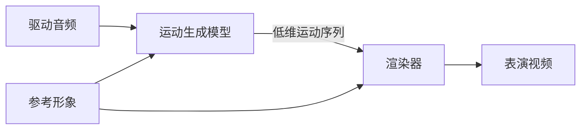

> 本文是数字人系列文档的入口篇。各路线与专题的深挖见同目录：[动作空间专题](../动作空间专题.md)、[Avatar Forcing 模型精读](../模型精读/Avatar%20Forcing%20模型精读.md)、[Ditto 模型精读](../模型精读/Ditto%20模型精读.md)，工程侧见 [CyberVerse 工程专题](../工程与评测/CyberVerse%20工程专题.md) 与 [评测指标专题](../工程与评测/评测指标专题.md)。项目全景见 [[project:digital-human]]。

## 一、先分清两层：数字人 vs 数字人系统

讨论数字人时必须先区分两个层次：

| 层次 | 是什么 | 关心的问题 |
|------|--------|-----------|
| **数字人**（生成模型） | 一个视频生成任务 | 生成质量、推理速度 |
| **数字人系统**（产品） | 围绕模型的一整套交互管线 | 端到端延迟、可用性、交互体验 |

为什么要先分清？因为聊"实时数字人"时，**模型达标 ≠ 产品可用**。论文里的 FPS 是模型单独跑的吞吐，产品里还要叠加 ASR、LLM、TTS 的级联延迟和网络传输——这就是"论文 FPS ≠ 产品 SLA"（详见 [评测指标专题](../工程与评测/评测指标专题.md)）。

## 二、生成任务：输入 → 形象 → 驱动 → 输出

数字人本质上是一个视频生成任务，四步流程：

1. **输入身份条件**：一张图片、一段视频，或一个固定的数字人资产
2. **创建形象**：根据输入条件生成数字人的外观
3. **输入驱动信号**：文本或语音
4. **输出表演视频**：数字人形象按驱动信号表演出内容匹配的人物视频

### 两个正交评价维度（本文核心心智模型）

对输出视频的要求可以从两个维度理解，二者正交：

**生成质量**——从无到有，逐步覆盖更多身体部位：

唇同步 → 面部表情 → 头部姿态 → 手部动作 → 全身运动

**工程性能**——从离线到实时：

离线生成（不要求速度）→ 近实时（秒级延迟）→ 实时交互（毫秒级、支持打断和流式输出）

任何数字人工作都可以定位到这个二维平面上。例如换嘴方案质量低但快，整帧扩散质量高但慢，而实时交互数字人必须在质量和速度上同时达标——这是最难的象限。

### 任务分类速览

video dubbing（换嘴配音）/ talking head / portrait animation / 3D avatar / 上半身交互 / 流式基模——六分类一句话了解即可，日常讨论主要用前文的两个维度。

## 三、四条主流技术路线

分类依据是**任务分解方式**——生成模型负责什么、渲染器负责什么，而非 2D/3D 之分。

### 3.1 局部换嘴

只重绘嘴部 ROI，其余帧来自原视频。代表：Wav2Lip、MuseTalk。

稳定、便宜、易落地，但表情、头动、手势全受限。适合视频配音（dubbing）场景，不适合实时交互数字人。

### 3.2 动作空间生成（motion space）——团队当前主力

把"身份外观"和"运动"拆开：生成模型只预测低维运动序列（3DMM 系数 / 面部 latent / keypoints），渲染器把运动作用到参考身份上。

**扩散演进线**：SadTalker（3DMM 系数，无扩散）→ VASA-1（面部动力学 latent + Diffusion Transformer）→ Ditto（显式 motion representation + Conditional DiT，流式推理）→ Avatar Forcing（motion latent + Diffusion Forcing，500ms 实时交互）

动作空间的具体表示（FLAME、blendshape、隐式关键点……）是理解这条路线的钥匙，单独展开在 [动作空间专题](../动作空间专题.md)。

渲染器消费侧的标准形态——3D 引擎的渲染循环：

头姿驱动变换矩阵、表情驱动表情系数，每帧循环渲染。图中的"表情系数"正是动作空间里的 blendshape / 3DMM 系数。

### 3.3 3D 资产路线

为特定人训练可渲染资产（NeRF / 3DGS），一条效率演进线讲清转折：

| 工作 | 训练成本 | FPS |
|------|---------|-----|
| AD-NeRF | 167.6h | 0.04 |
| ER-NeRF | — | 15.2 |
| EGSTalker | 3.7h | 68.5 |
| GSTalker | 40min | 125 |

转折点是 NeRF 的体采样换成 3DGS 的光栅化——专人资产从"科研 demo"进入"可部署"。

**与 3.2 的关系**：3DGS 也可以作为动作空间路线的渲染器（LAM 的做法：Gaussian avatar 重建在 FLAME canonical space，每个 Gaussian 继承 FLAME 顶点的 blendshape 和 skinning weights）。

### 3.4 整帧视频扩散基模

直接在视频 latent / 帧空间生成（FlashHead、LiveAvatar、Self-Forcing 流式蒸馏）。表现自由度最高——身体、背景、场景都能生成，但成本高、长时稳定与实时化困难。实时化的主要手段是流式蒸馏（蒸馏出少步或自回归的 student）。

## 四、数字人系统：从模型到产品

级联管线四组件：

| 组件 | 作用 |
|------|------|
| **ASR**（自动语音识别） | 把用户语音转成文字 |
| **LLM**（大语言模型） | 理解上下文，生成回复文本 |
| **TTS**（文本转语音） | 把文字变成数字人的声音 |
| **Avatar 渲染** | 生成数字人的视觉形象 |

三种架构范式：**级联**（组件独立、可控、延迟高）vs **端到端**（如 A2-LLM，TTFA 535ms）vs **混合**（级联框架 + 端到端局部模块）。流式级联全链路约 3.2s——差距来自分块等待和组件间排队。

系统通常还集成 Agent 能力（RAG 检索、工具调用、记忆人格），让数字人像智能体一样完成任务。这套系统的完整工程实践见 [CyberVerse 工程专题](../工程与评测/CyberVerse%20工程专题.md)。

## 五、实时性：两大工程战场

**传输层**：WebRTC / WebSocket 选型。WebRTC 自带 jitter buffer、NetEQ 隐藏、抗弱网，但建联复杂；WebSocket 简单但要自己做平滑。实时交互场景基本必选 WebRTC。

**推理层**：流式 TTS 分块合成 + Avatar 异步渲染，让文本到视频的全链路分段执行、减少首帧等待。轻量开源方案的经典技巧：滑动窗口重叠融合（LiteAvatar 的 1 秒窗口）、静音回退中性口型、说话/静音状态机。

## 六、怎么衡量好坏

五大指标族索引（详解见 [评测指标专题](../工程与评测/评测指标专题.md)）：

| 指标族 | 代表指标 | 回答的问题 |
|--------|---------|-----------|
| 唇同步 | Sync-C / Sync-D | 嘴型和声音对得上吗 |
| 身份 | CSIM | 还是同一个人吗 |
| 画质 | PSNR / SSIM / LPIPS | 画面质量如何 |
| 漂移 | CSIM-drift / Dino-S | 时间长了会变差吗 |
| 效率 | FPS / TTFF / 延迟 / 显存 | 跑得动吗 |

关键口径：**论文 FPS ≠ 产品 SLA**。评测框架的完整实践见 [[project:digital-human]]。

## 面试追问预案

**Q：为什么实时数字人偏爱动作空间路线，而不是直接用视频扩散？**

核心是算力分配。整帧扩散每帧都要重新生成身份纹理、头发、背景——这些在固定形象场景下是不变的，重算纯属浪费。动作空间把生成目标收缩到低维运动序列（Ditto 只有 265 维），身份纹理由渲染器保留，算力全花在"怎么动"上。代价是上限受运动表示和渲染器限制——如果业务需要生成身体和复杂背景，还得回到整帧路线。

**Q：两条评价维度为什么说"正交"？**

给定的模型可以在任一维度上移动而不必然影响另一维度——换嘴可以做到很快但质量天花板低，整帧扩散质量高但慢。但"实时交互"同时卡住两个维度：既要覆盖表情/头姿（质量），又要毫秒级流式（性能），这就是为什么实时交互数字人是最难象限，也是流式蒸馏（Self-Forcing 等）这条研究线存在的原因。

**Q：3DGS 路线和动作空间路线是什么关系？**

不是并列排斥关系。3DGS 是一种**渲染器**（可渲染资产），动作空间是一种**任务分解**（生成模型只管运动）。LAM 把两者组合：Gaussian avatar 建在 FLAME canonical space 里，用 FLAME 系数（动作空间）驱动 3DGS 渲染。所以准确的说法是：四条路线是分解方式的分类，3DGS 是其中几条路线可复用的渲染后端。
