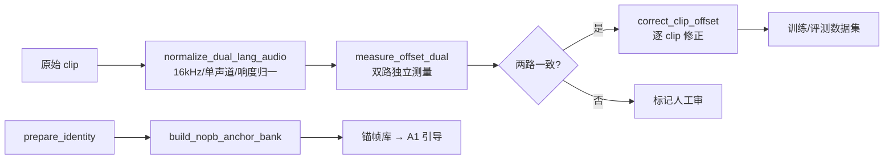

> 工具链在 `~/DigitalHuman/finetune-avatarforcing/scripts/`（prepare_dual_lang_tts / normalize_dual_lang_audio / measure_offset_dual / correct_clip_offset / prepare_identity / build_nopb_anchor_bank）与 `~/code/digital_human/datasets/`（base/talkvid/conversation/long 适配器）。

## 一、数据域与适配器

训练与评测用三域数据：

| 域 | 内容 | 风格特征 |
|----|------|---------|
| talkvid | 通用说话视频 | 自然对话、多场景 |
| news | 央视联播 | 播报腔、端正头姿、语速稳 |
| linli | 补充域 | 扩大覆盖 |

评测框架侧另有四个数据集适配器：base / talkvid / conversation / long——适配器模式让"换数据集"不动框架代码。

双语 TTS 数据管线：`prepare_dual_lang_tts` 生成条目清单 → `normalize_dual_lang_audio` 归一 → 产出 `dual_lang_tts_items.jsonl` 供训练消费。

## 二、音频一致性：归一化

**为什么要做**：同一数据集里的 clip 来自不同来源——采样率不一（16k/44.1k/48k）、声道数不一、响度不一。特征抽取器（wav2vec/HuBERT）和唇同步评测对输入分布敏感：无关方差会污染特征，响度差异会让"音频能量-嘴开合度"类的指标失真。

**具体做法**（normalize_dual_lang_audio）：

- 重采样统一 16kHz 单声道（模型输入标准）
- 响度归一（统一感知响度基准）
- 静音段处理与片段切分（去首尾静音，避免训练时学"静音对口型"）

原则：**归一化只处理与任务无关的方差**（采样率/响度），不碰任务相关信号（语速、语调、情绪）。

## 三、Offset 对齐：音画错位的双重测量与修正

**为什么要做**：数据集的音频与视频常有毫秒级错位——剪辑、转码、抽帧都会引入。直接训练会教模型学"错位的唇形"（系统性的半帧偏移），唇同步指标也会被错位污染。

### 3.1 双重测量（measure_offset_dual）

两路**独立**的 offset 测量互为校验：两路方法不同源，若一致则测量可信；若分歧大，说明该 clip 本身有歧义（如转头遮挡），标记出来人工审。

### 3.2 修正与聚合（correct_clip_offset）

- 逐 clip 修正：按测得的 offset 平移音频/视频对齐
- **聚合 offset 口径**：评测时全 clip 用统一的 offset 处理流程——保证不同模型在同一数据集上的唇同步指标可比

## 四、身份数据与锚帧库

推理期锚点引导（A1，见 [Avatar Forcing 微调实践](../微调与实践/Avatar%20Forcing%20微调实践.md)）需要该身份的**特征字典**：

```
prepare_identity          身份素材准备（参考视频/图像 → 规范化）
    ↓
build_nopb_anchor_bank    锚帧库构建（提特征 → 建字典）
    ↓
A1 推理期引导             c_hi=0.99，300s csim 0.645→0.935
```

锚帧库的质量直接决定引导效果——库要覆盖该身份的典型姿态与表情分布，否则最近邻匹配会选出不合适的锚。

## 五、管线全景



## 面试追问预案

**Q：offset 为什么用两路独立测量，一路不行吗？**

单路测量没有"自我纠错"能力：方法对某类 clip（遮挡、快速转头、静音段长）系统性失效时，错误会静默地混进训练数据。两路独立方法（不同原理）交叉验证，分歧即报警——本质是用冗余换可信度，成本只多一次离线测量，远比带着错位数据训完再排查便宜。

**Q：音频归一化会不会破坏数据多样性？**

要区分两类方差。采样率、声道数、响度是**采集方差**——由设备与来源决定，与说话内容无关，必须归一掉，否则模型在学"不同录音设备的特征差异"。语速、语调、情绪是**内容方差**——是任务信号，动它们才是破坏多样性。实践中判断标准：如果这个维度换了采集条件就变，它就该被归一。

**Q：锚帧库怎么设计才算"够用"？**

两个维度。**覆盖度**：库里的帧要覆盖该身份在目标场景中的典型姿态/表情/光照分布——库里没有侧面帧，侧面漂移就拉不回来。**纯度**：每帧的特征必须干净（对齐好、无遮挡），脏帧会作为锚把生成带偏。我们的做法是构建时按姿态聚类采样 + 人工抽检，宁缺毋滥——A1 的部署规则"有库开、无库关"也正是承认库质量不够时不如不用。
