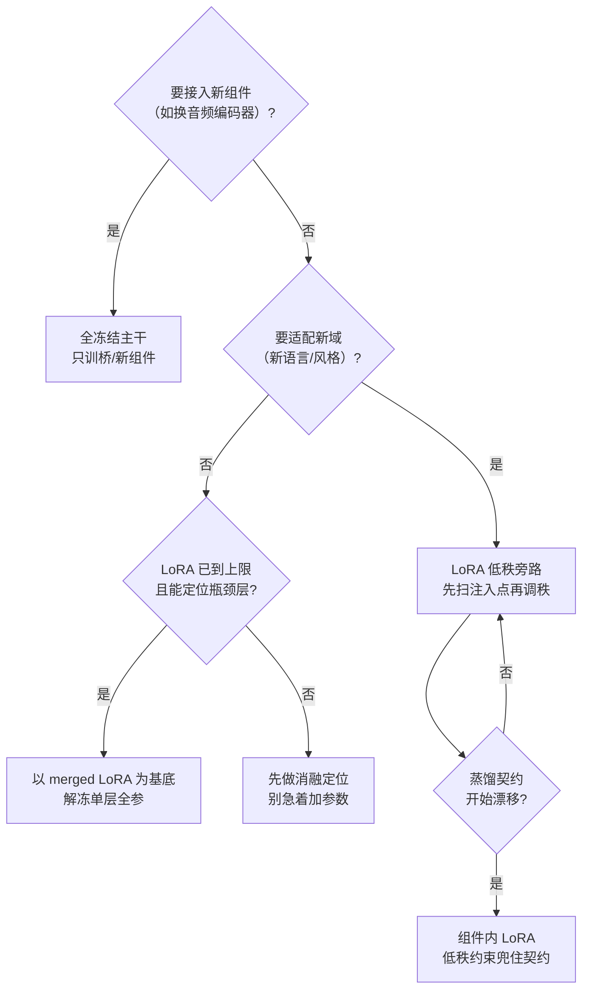

> 案例都来自 Avatar Forcing 中文微调（`~/DigitalHuman/finetune-avatarforcing`），但方法论通用。背景见 [Avatar Forcing 微调实践](Avatar%20Forcing%20微调实践.md)。

## 一、微调形态光谱

从"动得最少"到"动得最多"排列：

| 形态 | 我们的做法 | 可训参数量 | 适用场景 |
|------|-----------|----------|---------|
| **全冻结，只训新组件（桥）** | 蒸馏桥 B_new 全开放精调，flow/wav2vec 全冻结 | 桥 4.7M | 接入新音频编码器，不想动主干 |
| **LoRA（低秩旁路）** | flow cross-attn q/kv，rank16 | 低秩增量 | 主干域适配（中文化），数据有限 |
| **单层全参解冻** | targets=none 骨架全冻结，唯一放行 final_layer | 2.624M | 瓶颈层探针（历史零训练的层） |
| **整块开放 vs 桥内 LoRA** | 桥全开放精调 vs 桥内注入 rank16 LoRA（~0.15M） | — | 蒸馏契约漂移问题（见下） |

## 二、实战结论（每条都有实验背书）

### 2.1 注入点是唯一有效轴

三轴消融（注入层 / 秩 / 数据量）里，**只有注入位置带来收益**（q,kv,proj 组合 +0.39 LSE-C）；秩与数据量在数据不足阶段都不是瓶颈。

两轮注入点调研的细节：

- **Round 1**：`q,kv,proj` 三轴 → 但 `proj` 这个名字同时命中三处职责不同的模块（attn.proj / cross_attn.proj / x_embedder.proj），收益来源不明
- **Round 2**：target 语法升级为**路径后缀精确匹配**（`*.cross_attn.proj` 只命中 8 个目标）+ 训练前打印注入点命中清单（可审计）+ 4 臂消融（crossproj / mlp / selfonly / full）+ 条件模块 c_embedder 臂
- 教训沉淀：模糊的模块名匹配让消融结论不可信——先让注入点可审计，再做消融

### 2.2 数据是瓶颈的判据

多域（talkvid+news+linli，257 clips）训练后 md_georkd_best sync_c 6.299 全臂第一——"数据不足"假设成立。**在容量没用满之前，加数据优于加参数**。

### 2.3 全开放的代价：契约漂移

桥全开放精调（路线 A）把桥的蒸馏增益从 +0.38 吃到 +0.13：训练侧 sync 在降，验证侧 guided_flow 却恶化——桥偏离了它和主干之间的"蒸馏契约"。

**桥内 LoRA**（路线 B）：桥基底权重冻结，只在桥的 Linear 层注入 rank16 LoRA（~0.15M）——低秩约束让桥"吸收监督信号又不过度偏离契约"。

这是"开放区域越大越好"的直接反例。

### 2.4 解冻单层的判据：找历史空白区

FinalLayer readout（Linear 512→512 + adaLN 512→1024，实测 2.624M——早期按 hidden 512 估的 0.79M 是错的）：

- **动机**：核查发现全部 17 个历史训练臂从未碰过 `final_layer.*`——它是主干外唯一从未微调的可训组件，且只在英文原数据上训过。假设：主干已学会中文音节区分，但 readout 把中文 viseme 方向投影进低增益方向
- **方法**：以训好的 geom_lora_s30 merged 为基底（`--flow-init` strict 载入）再解冻——**先训好 LoRA 再解冻，归因最干净**
- **配套**：`--early-stop-patience 3`（val 连续 3 ep 高于谷底即停）

### 2.5 工具链

| 工具 | 作用 |
|------|------|
| `--flow-init` | 任意 merged ckpt 作为训练起点，strict 载入 |
| `--early-stop-patience N` | 谷底连升即停，防过拟合烧卡 |
| `export_merged` | adapter 合并导出，全参键自动识别与基底回填 |
| 注入点命中清单打印 | 训练前审计每个 target 实际命中哪些模块 |

### 2.6 指标对照

| 形态 | sync_c（videoc1 口径） |
|------|----------------------|
| baseline | 5.288 |
| round1 冠军 layer_proj | 5.677 |
| geom_lora_s30（锚） | 6.122 |
| **md_georkd_best（多域）** | **6.299** |

## 三、决策树

## 面试追问预案

**Q：LoRA rank 怎么选？为什么是 16？**

我们的经验：rank 在 8~32 区间内收益差异远小于注入点选择的差异——先扫注入点（收益主轴），rank 用 16 这种保守默认值即可。这是因为域适配任务（中文化）的真实本征维度不高，rank16 的容量已够；真正缺的是"注入对地方"。如果注入点已最优还差容量，才值得做 rank 扫描。

**Q：怎么判断"该解冻了"？**

三个信号同时满足：① LoRA 已收敛到平台期，加数据不动了；② 有明确归因的瓶颈定位（我们靠历史臂审计发现 final_layer 零覆盖）；③ 接受单层实验的归因成本（解冻后指标变化只能归因于这层）。缺任何一个都先回去做消融——"感觉该解冻了"不是理由。

**Q：桥内 LoRA 和直接给桥降 rank 有什么区别？**

降 rank 是**改变组件结构**——桥的表达上限被永久压缩，且要重训。桥内 LoRA 是**在冻结的原结构上加增量**——原契约（B_new 基底权重）原封不动，LoRA 只学"在契约附近的小偏移"。推理时可以合并，部署形态无差别。本质区别：约束施加在"偏移量"上而不是"组件本身"上，保留了组件的全部容量以备后续数据充足时重训。
