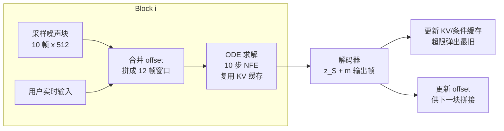

> 本文只讲模型本身（以博客精读文章为底稿压缩改写）。我们的微调与改造见 [Avatar Forcing 微调实践](../微调与实践/Avatar%20Forcing%20微调实践.md)，背景知识见 [数字人基础](../基础/数字人基础.md)。

## 一、任务设定：交互式数字人

Avatar Forcing 解决的是**双向对话**：输入用户的多模态信号（音频/视频）+ avatar 要说的音频，输出 avatar 的响应视频。关键差异——不是"音频驱动头像"的单向生成，而是对话场景：模型要听（用户信号）、说（avatar 音频）、有反应（listener 行为），且必须实时（可打断、可流式）。

关键数字：**推理延迟 500ms、加速比 6.8×、人类偏好 >80%**。

## 二、三模块架构

### 2.1 Motion Latent Encoding：显式 identity-motion 分解

FLOAT motion latent autoencoder 把输入图像编码为 latent，并**显式分解**：

$$z = z_S + \mathbf{m}_S \in \mathbb{R}^{512}$$

- $z_S$：identity latent（这个人长什么样）——**整个对话中保持固定**
- $\mathbf{m}_S$：motion latent（面部表情 + 头部姿态）——模型逐帧只预测这个

直觉类比：一张照片拆成"底片"和"滤镜"两张透明片——换表情只换滤镜，底片不动。直接在像素空间建模的问题：512×512×3 每帧计算量巨大，且身份与运动信息高度耦合。这个分解让生成任务收缩到"预测 512 维运动增量"。

### 2.2 Dual Motion Encoder：统一条件编码

把用户多模态信号与 avatar 音频编码为统一条件，供生成器交叉注意。

### 2.3 Causal DFoT Motion Generator：因果 Diffusion Forcing

核心选择：**因果（causal）** Diffusion Forcing Transformer。与常规双向视频扩散的区别——双向模型一次生成整段（未来帧影响过去帧，无法流式），因果模型保证帧 i 的生成只依赖 ≤i 的信息，从而支持逐块自回归。代价是训练难度更高（见下文 Diffusion Forcing 的处理）。

## 三、流式推理：blockwise rollout

推理以 block 为单位自回归：

- **KV/条件缓存**：历史块的 key/value 缓存复用，不重复计算
- **独立 CFG 三路缓存**：classifier-free guidance 的无条件 / 仅音频 / 全条件三路向量场分别缓存
- 10 帧/block、12 帧 ODE 窗口（10 新帧 + 2 帧 offset 衔接）——500ms 延迟的来源就是这套分块机制

## 四、两阶段训练

| 阶段 | 内容 | 配置 |
|------|------|------|
| Stage 1 | Diffusion Forcing 训练：motion latent space 中学习条件自回归 | 50 帧序列分 5 block，**同 block 帧共享噪声时间步、跨 block 独立采样**（DF per-token noising 核心），2000k steps |
| Stage 2 | DPO 微调 | λ=0.1、β=1000，仅需 5k steps 封顶；less-preferred 样本由仅音频条件的 FLOAT 模型生成 |

数据：RealTalk + ViCo 两个 dyadic conversation 数据集；预处理 PySceneDetect 场景切割 → 人脸追踪裁剪 512×512 → IIANet 语音分离（区分 speaker/listener）→ 25fps / 16kHz。Motion latent autoencoder 在此数据上重训（非直接用 FLOAT 原权重）。单张 H100。

**同 block 共享噪声时间步**为什么重要：这是 Diffusion Forcing 区别于标准视频扩散的关键——每个 block 有自己的噪声水平，训练时模型同时见到不同去噪程度的块，推理时才能逐块自回归地滚动生成。

## 面试追问预案

**Q：为什么选因果结构，放弃双向扩散的生成质量？**

交互场景的硬约束是"未来不存在"。双向扩散生成第 1 帧需要第 50 帧的信息，意味着必须等整段生成完——这在对话里不可接受。因果结构牺牲了全局一致性（帧间过渡靠 offset 和缓存维系），换来的是任意时刻可以开始/打断/切换输入。这是典型的"系统约束倒逼模型结构选型"。

**Q：identity-motion 分解和 DiT 的运动空间拆分是一回事吗？**

思想同源但粒度不同。Ditto 在**表示层**拆（265 维里有显式的 kp/exp/pose 分组），FLAME 在**语义层**拆（每维有名字）；FLOAT latent 在**隐空间**拆（512 维向量加法分解，无逐维语义）。分解是所有动作空间路线的共同直觉——"谁在说话"和"怎么动"分开处理——差异只在于分得显式还是隐式。AF 的分解够用是因为它的渲染器（decoder）不需要逐维语义，只需要 z_S 提供身份。

**Q：DPO 只有 5k steps，为什么这么少就有效？**

DPO 的输入是成对偏好样本（preferred = 完整条件生成，less-preferred = 仅音频条件的 FLOAT 生成），它做的不是继续学生成，而是在已收敛的生成分布上"拉开好坏差距"——微调的是偏好方向，不是能力。作者也明确说继续训无增益。这个设计对资源受限的复现者很友好：最贵的 Stage 1 只需要跑一次。
