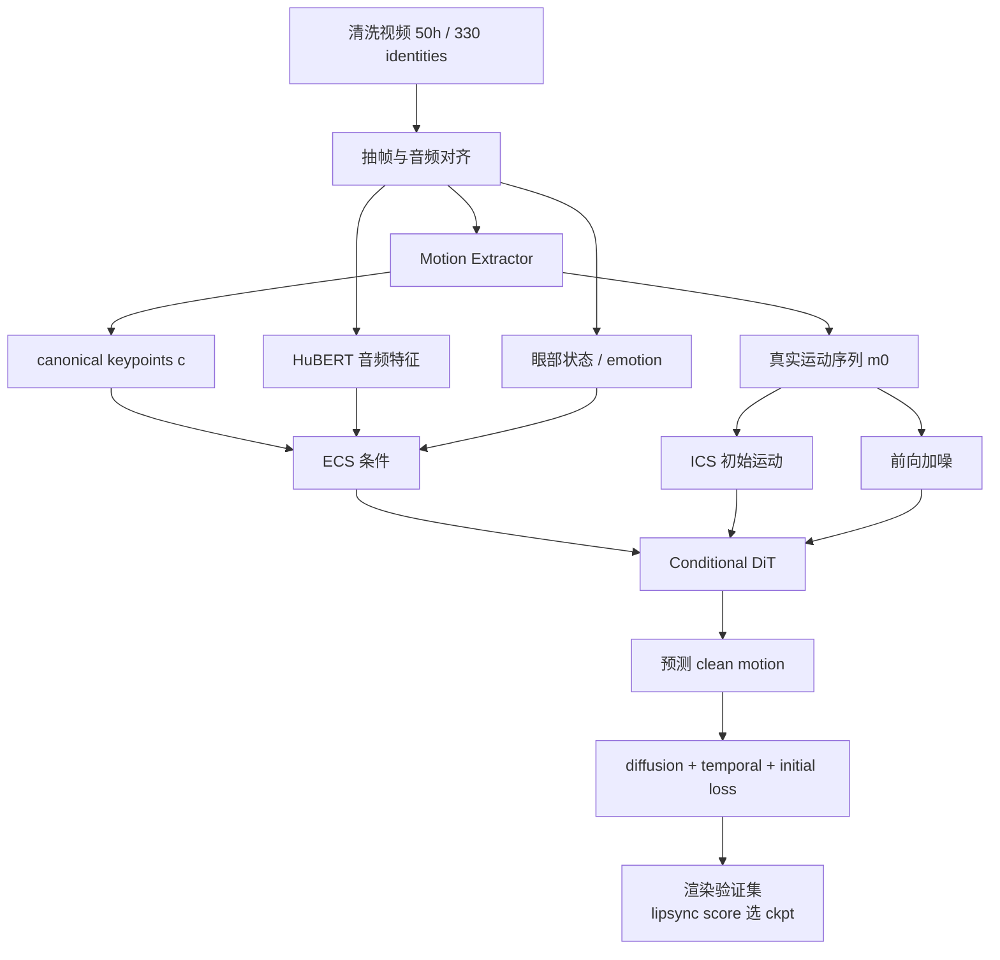

> 本文只讲模型本身（以博客精读为底稿压缩改写）。我们的改动（唇动隔离等）见 [Ditto 改动实践](../微调与实践/Ditto%20改动实践.md)，motion space 表示细节见 [动作空间专题](../基础/动作空间专题.md)。

## 一、任务分解："生成空间"比"生成模型"更重要

Ditto 的核心判断：对实时数字人而言，选择在什么空间生成，比选择什么生成模型更关键。

| 路线 | 优势 | 瓶颈 |
|------|------|------|
| GAN / NeRF / 显式系数（Wav2Lip、SadTalker） | 快、可解释 | 表情头动自然度不足 |
| 像素 / 通用 VAE latent 扩散（EMO、Hallo） | 表情丰富 | 空间冗余、推理慢 |
| **运动空间扩散（VASA-1、Ditto）** | 目标低维适合实时、易控制 | 上限受运动表示约束 |

论据：目标空间太冗余，算力浪费在身份纹理和背景；太隐式，又难以控制修复。运动空间居中——足够低维便于实时，又保留表情/头姿/眼神等可干预结构。

任务被拆成两层：**音频到面部运动**（生成模型的事）+ **运动到视频渲染**（渲染器的事）。"谁在说话"与"怎么动"分离。

## 二、Motion Space：扩散模型只预测运动

单帧图像经 Motion Extractor $\mathcal{M}$ 输出：

- canonical keypoints $\mathbf{c} \in \mathbb{R}^{K\times3}$（身份基准骨架）
- expression deformation $\boldsymbol{\delta}$（表情形变）
- head rotation $\mathbf{R}$、translation $\mathbf{t}$

扩散模型预测的是 $\mathbf{m}=\{\boldsymbol{\delta},\mathbf{R},\mathbf{t}\}$（265 维、identity-agnostic），**不碰图像 latent**。

从运动到隐式 3D keypoints：

$$\hat{\mathbf{x}}=\mathbf{c}_{ref}\hat{\mathbf{R}}+\hat{\boldsymbol{\delta}}+\hat{\mathbf{t}}$$

$\mathbf{c}_{ref}$ 来自参考身份（身份保留），生成的运动叠加在参考骨架上。

## 三、Conditional DiT（LMDM）与双条件系统

**ECS（Enhanced Conditional Signals）**——通过 cross-attention 在整个片段持续引导：

| 信号 | 来源 | 作用 |
|------|------|------|
| 音频特征 | HuBERT | 口型、语速、节奏 |
| 眼部状态 | aspect ratio + pupil position | 眨眼、gaze（音频解释不了的部分） |
| canonical keypoints | 参考帧 | 适配目标身份几何 |
| emotion label | clip 级标注 | 表情强度与风格 |

**ICS（Initial Conditional Signal）**——参考初始运动，复制到序列长度后**与噪声序列拼接**：负责片段起点稳定，降低长序列拼接跳变。

## 四、训练管线：把视频"训成运动生成器"

关键步骤：

1. **把真实视频压到 motion space**：高维视频监督信号变成低维运动序列——DiT 学的不是 RGB 像素，而是 renderer 能理解的动作指令
2. **两类条件构造**：ECS（持续约束）+ ICS（起点连续性）
3. **处理 motion representation 偏差的训练技巧**：
   - **Horizontal flip**：野外视频头部朝向分布不均，翻转平衡左右朝向的 audio-to-motion 关系
   - **Adaptive loss weights**：按控制区域（嘴/眼/表情/头姿）分组，根据相邻 epoch 平均 loss 差异动态调权 + softmax 调整系数——统一权重会让某些区域训练不足（消融中影响很大）

## 五、推理与可控性

- **流式推理**：RTF（Real-Time Factor，处理时长/真实时长）达标，首帧延迟 385ms
- **可控性**（motion space 的直接红利）：gaze correction（改眼部条件重渲染）、眨眼控制、emotion label 切换——这些在像素空间路线里几乎无法干预
- 265 维运动表示 + 渲染器解耦，也让我们后来能在渲染层做区域级操作（见改动实践篇）

## 面试追问预案

**Q：Ditto 和 VASA-1 都是运动空间扩散，差异在哪？**

运动表示不同：VASA-1 在"整体面部动力学 latent"里生成（容量大但隐式），Ditto 用显式混合表示（keypoints + deformation + rotation + translation，265 维）+ Conditional DiT。Ditto 的显式表示带来三个工程优势：控制粒度（按区域干预）、开源可复现的推理链路、渲染器解耦（表示和渲染可以独立替换）。VASA-1 没开源，其 latent 表示对外部开发者不可用。这也解释了为什么我们选 Ditto 做基础——可改。

**Q：为什么用 lipsync score 选 checkpoint 而不是常规 val loss？**

任务的评价目标是"音频-运动对齐"，但 val loss 混合了所有区域的回归误差（包括与说话无关的头姿预测）。用渲染验证集 + lipsync score 直接优化最终关心的能力。这也是我们在评测框架里坚持"指标要对应问题"的同一逻辑（见 [评测指标专题](../工程与评测/评测指标专题.md)）——代理指标和最终目标错位时，checkpoint 选择就会被带偏。

**Q：horizontal flip 为什么必要？听起来只是数据增强。**

不只是增强。音频到运动的映射对左右朝向不对称：野外数据（访谈、演讲）里人脸朝向有系统性偏置，模型会学到"偏向某一侧"的运动习惯，推理时生成的人头会慢慢歪。flip 平衡的是 audio-to-motion 关系的空间分布，不是普通的图像增强。这个细节说明：motion space 路线里，数据分布问题会直接变成生成行为偏置。
